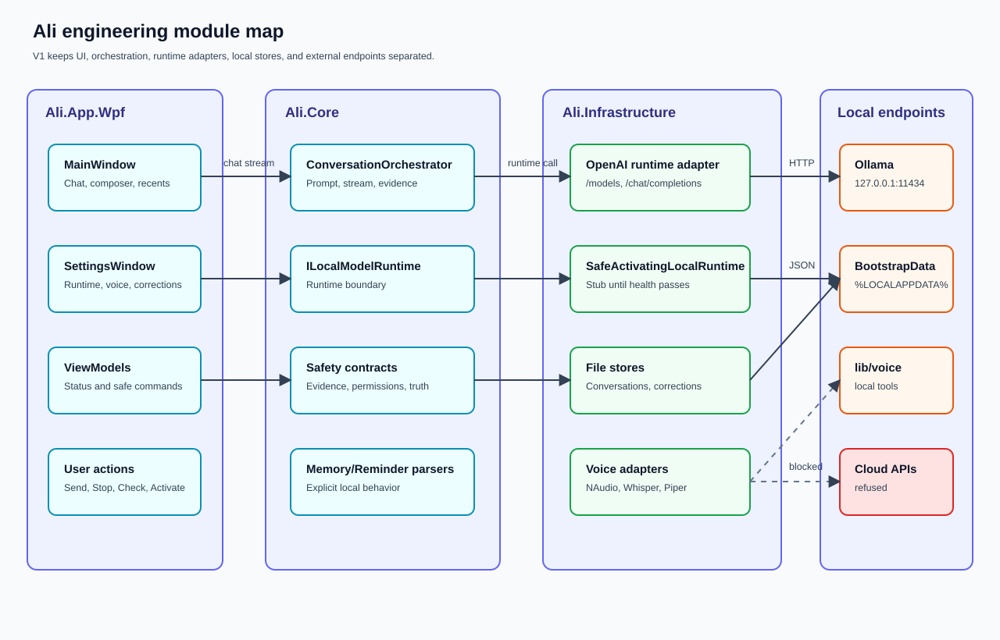
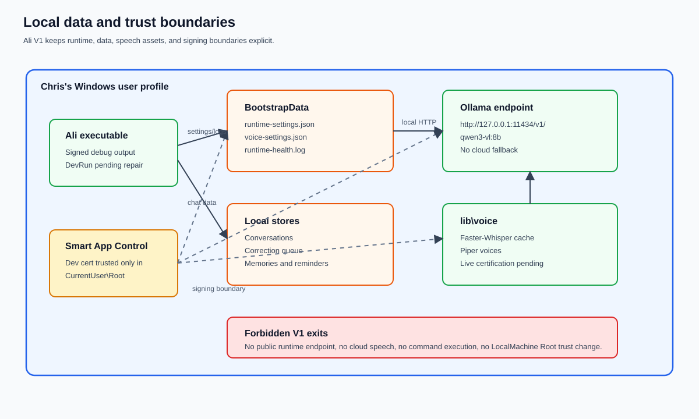
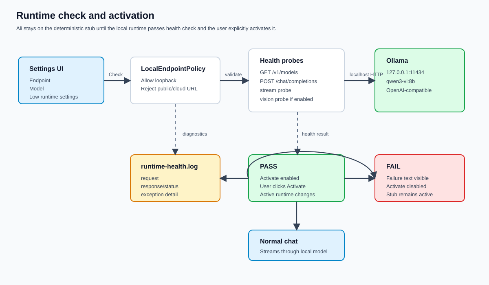

# Ali Engineering Notes

## Launch Slice

This repository starts with the smallest useful slice:

```text
WPF composer
-> local runtime boundary
-> streamed answer
-> stop/cancel
-> evidence status
-> flag as incorrect
-> correction queue persistence
-> optional screenshot/image attachments
-> local vision payload proof
-> local voice loop boundary
```

The active runtime starts as a local deterministic development stub. It does not pretend to be a real model.

The first real runtime path is now present:

```text
runtime-settings.json or ALI_OPENAI_* environment variables
-> local endpoint policy
-> OpenAI-compatible adapter
-> Check Runtime
-> health check
-> visible activation
```

Ali only switches from the stub to the configured runtime after the health check succeeds and the user clicks `Activate Runtime`.

## Program Flow Images







## Current Project Shape

```text
Ali.sln
src/Ali.App.Wpf
src/Ali.App.WebHelper
src/Ali.Core
src/Ali.Infrastructure
tests/Ali.Tests
docs
```

## Safety Foundations Added

- `EvidenceStatus`: `Verified`, `Inferred`, `Unverified`, `Unknown`
- `ActionReceipt`: the proof object for tool/build/test/calendar claims
- `TruthfulnessPolicy`: first non-deception helpers
- `PermissionRisk`: risk groups for future execution gates
- `PermissionService`: bootstrap confirmation policy
- `CorrectionQueueService`: preserves exact Q/A when an answer is flagged
- `ILocalModelRuntime`: local model boundary
- `OpenAiCompatibleLocalModelRuntime`: first real local HTTP adapter
- `LocalEndpointPolicy`: refuses public/cloud endpoints in local-only mode
- `SafeActivatingLocalRuntime`: keeps the fallback active until health passes
- Runtime settings UI: load/save/check/activate/revert without a model library
- Image attachment contract: temporary-by-default PNG data passed only through the current chat request
- WPF attachment UX: paste image, capture full screen, preview, retain toggle, remove
- Voice contracts: recorder, STT provider, TTS provider, speech player
- Local voice adapters: NAudio WAV record/playback, Faster-Whisper CLI STT wrapper, Piper CLI TTS wrapper
- Voice input tuning: persisted device selection, live NAudio level monitor, simple DSP presets, capture diagnostics
- Voice safety: risky spoken commands are blocked in Phase 1C before they can be sent as action requests
- Spoken response cleaner: removes URLs, markdown clutter, code blocks, stack traces, metadata, and citation markers
- Correction reports now carry optional voice transcript/provider metadata without retaining raw audio
- Local coding workspace policy: limits coding file actions to the approved programming workspace unless explicitly configured
- Local coding tool service: workspace inspection, build-idea scouting, file open/read/search, package listing, guarded build/test/run/restore, guarded Git, receipts, patch preview/apply, last-failure diagnosis, and simple PDF generation

## Coding Assistant Flow

The coding assistant is intentionally tool-gated:

```text
user request
-> command parser
-> workspace policy
-> local coding tool
-> receipt
-> chat response
```

For open-ended coding questions, Ali injects a read-only coding context pack into the model prompt:

```text
workspace map
package references
relevant source/config files
last failed dotnet command, if any
diagnostic source excerpts, if any
guarded task plan
```

For explicit coding commands, Ali handles the request deterministically before calling the model.

Current deterministic command groups:

- Workspace: open/list/inspect approved coding workspace, including deterministic solution architecture analysis, project role classification, project dependency graphing, coding tool integration status, and Visual Studio integration handoff planning.
- Read/search: open file, read file, search workspace.
- Planning: build a guarded coding task plan, interpret build goals, compare architecture options, write acceptance criteria, suggest focused tests, detect codebase patterns, plan feature files, run refactor safety checks, scout proposed build ideas with implementation paths and library exploration candidates, draft read-only implementation roadmaps, manage persisted pending/approved roadmap execution state through a guided step loop, approve numbered execution packets, show a packet command console, run packet items through normal gates, track packet ledgers, plan package lookups with dependency risk cards, plan dependency install packets, preview project scaffolds, plan scaffold apply flow, plan post-edit validation, show a coding skill command index, show a coding session summary, and resume interrupted build plans from receipts.
- Packages: list package references, confirmed package installs, and confirmed outdated checks.
- Build/test/run: confirmed `dotnet build`, `dotnet test`, `dotnet restore`, `dotnet run`.
- Diagnostics: summarize dotnet diagnostics, diagnose last failure, open the first diagnostic file at the reported line, and suggest narrow preview-only patches from supported diagnostics.
- Patch loop: preview literal replacement or a small literal patch bundle, show pending preview, discard pending preview, confirm apply last preview.
- File edits: confirmed create, append, and literal replace inside approved workspace.
- Git: status/diff/log plus confirmed add/commit/merge; pull/push are blocked unless enabled.
- Reports: simple local text PDF generation, coding session report PDF generation, and morning build report PDF generation into Ali's generated documents folder.
- Windows troubleshooting: read-only PowerShell/CMD troubleshooting toolkit, rogue-process hunt planning, process evidence collection, port owner diagnosis, file/build-lock diagnosis, service/startup guidance, event-log triage, and strict approved process-stop execution by numeric PID. Process stop requires confirmation and uses a normal PID taskkill without a force flag.
- Build/install intelligence: classify the last dotnet failure, check roadmap step acceptance against receipts/Git/validation, and run an install doctor report for DevRun, Visual Studio, VSIX, runtime, and dependency readiness.

The patch loop remains deliberately narrow. It applies only exact literal replacements and requires preview plus confirmation. Patch bundles allow up to eight edits total and can apply multiple sequential edits in the same file. Showing or applying a pending preview revalidates the current file contents so stale previews are not applied.

The `suggest patch from last failure` command is preview-only. It currently supports one deterministic compiler-repair case: `CS1002 ; expected` with an openable source file/line inside the approved workspace. The command stores a pending patch preview only when the exact line replacement can be validated through the normal patch preview path.

Approved execution packets are stored as local JSON planning state. `show packet commands` flattens prep, execute, validate, and closeout commands into a numbered console. Read-only commands can be run by number. Commands that are mutating or already carry a confirmation prefix require `confirm run packet item N`; the selected command then flows back through the normal parser, policy, execution, and receipt path. `show packet ledger` filters receipts since packet approval and compares them against prep/execute/validate/closeout lanes.

Builder planning commands are deliberately non-executing. `interpret build goal`, `show architecture options`, `write acceptance criteria`, `suggest tests for`, `detect codebase patterns`, `plan feature files`, and `show refactor safety checklist` generate deterministic local reports from the goal text and current workspace shape. They do not edit files, install packages, run builds/tests, or claim current package versions.

Package lookup, dependency install packets, scaffold previews, scaffold apply flow, and post-edit validation planning are also deliberately non-executing. `plan package lookup <goal>` emits exploration lanes, risk cards, and approval commands but does not hit NuGet or the internet. `plan dependency install packet <goal>` emits restore/install/build/test approval commands and rollback notes but does not install anything. `preview project scaffold <goal>` emits a proposed file/project/test shape but does not create files or modify solutions. `plan scaffold apply <goal>` describes how to move from preview to confirmed file creation using existing gates; it is not a project/solution generator yet.

Windows troubleshooting commands are read-only guidance. They include PowerShell/CMD recipes for `Get-Process`, `Get-CimInstance Win32_Process`, `Get-NetTCPConnection`, `netstat`, `tasklist`, services, startup commands, event logs, disk checks, and build-lock investigation. Process stops, service changes, startup changes, registry edits, firewall changes, PATH changes, and trust-store changes remain outside this command surface and require explicit owner approval.

`collect process evidence`, `diagnose port`, and `diagnose build lock` are evidence commands. `diagnose port` uses `netstat -ano` through the command runner and maps PIDs to safe process snapshots when possible. `confirm stop process <pid>` is the only process-stop executor in this lane; it accepts numeric PID only, blocks the current Ali command process, requires confirmation in policy, and does not use a force flag.

`classify last build failure` is a deterministic classifier over the stored last dotnet failure message. It labels common failure families and points to safe next commands. `show roadmap step checklist` is an advisory receipt/Git/validation checklist, not an automatic roadmap advance. `show install doctor` is a read-only install readiness report, not an installer.

Visual Studio integration now has three layers: configurable Visual Studio launch/discovery, an External Tools CLI bridge, and a developer VSIX project named `Ali.App.VisualStudioExtension`.

The `generate visual studio integration plan` command is a read-only bridge toward deeper integration. It reports the current launcher/workspace state, includes an architecture snapshot, and defines the minimum contract for a future VSIX tool window or local companion window: show status, submit deterministic Ali coding commands, pass current file/line context only on user action, and keep edits/builds/tests/Git writes inside the existing confirmation gates.

`Ali.App.WebHelper` now exposes a loopback-only coding command bridge:

```text
GET  /api/coding/status
POST /api/coding/command { "command": "show visual studio integration" }
```

Both endpoints honor the helper access token when configured and reject non-loopback callers. The built-in helper page includes the Programming Companion panel, with history on the left, chat in the center, and coding commands on the right.

`Ali.App.VisualStudioBridge` is a buildable CLI bridge for Visual Studio External Tools. It accepts solution/file/line context, expands command templates such as `{file}` and `{line}`, and sends the resulting deterministic command to the loopback coding bridge.

`Ali.App.VisualStudioExtension` is a buildable VSIX. It registers an `Ali Companion` tool window with native WPF controls for status, common coding commands, Visual Studio context, selected-code package preview, command history, progress/state cues, run timing summaries, pending-approval summary, command entry, and output tabs for response, diagnostics, receipts, and pending patch state. It reads active solution/document/line/selection context through Visual Studio automation, uses that context only to fill deterministic commands, and calls the loopback coding bridge directly instead of embedding the helper page inside Visual Studio. It also registers `Tools -> Options -> Ali -> Companion` for helper URL, history length, and selected-text context behavior. The VSIX includes local Project Ali branding metadata, packaged icon assets for the extension manifest and View menu command, a `Tools -> Ali Companion` command group, code editor context-menu commands that stage current-file, active-solution, search-selection, plan-selection, and preview-replace-selection actions, and Solution Explorer node commands that stage selected-file, selected-project, and selected-solution actions in the tool window. Commands use Visual Studio `BeforeQueryStatus` checks so action availability follows the active document, selected text, solution path, and Solution Explorer node context. The VSIX does not add direct file/build/Git authority; those actions still route through the local helper and Ali's normal confirmation gates. Professional plugin polish is tracked in `docs\ALI_COMPANION_PROFESSIONAL_PLUGIN_BACKLOG.md`.

The final Phase 1 coding companion cockpit groups commands by workflow instead of raw capability count: Start Here, Awareness, Guided Flow, Plan Tools, Execute, Diagnostics, and Reports. Start Here surfaces What Can Ali Do, Plan A Build, Fix A Build, Install Check, VS Setup, and Windows Help. The intended first-pass owner path is Goal -> Options -> Criteria -> Tests -> Roadmap -> Next -> Packet -> Validate. This is the current best stopping point before installer, dependencies, and model installation work resumes.

The bridge can auto-start `Ali.App.WebHelper` on loopback when the helper is offline, using `ALI_HELPER_URL` or the default `http://127.0.0.1:8765`. Pass `--no-start-helper` for fail-fast behavior. Native VSIX install/update notes live in `tools\visualstudio\ALI_COMPANION_VSIX_INSTALL_UPDATE_NOTES.md`; the optional External Tools fallback guide lives in `tools\visualstudio\ALI_VISUAL_STUDIO_EXTERNAL_TOOLS.md`.

Audio setup references live in `docs\source-catalogs\ali_audio_setup_sources.json` and are intended to be merged into `%LOCALAPPDATA%\Ali\BootstrapData\Sources\curated_sources.json`. The catalog is deliberately just source access for official Focusrite Scarlett Solo/2i2, Audio-Technica AT2040, TritonAudio FetHead, and Shure SH-BROADCAST2 material; it does not grant hardware control or bypass the normal truth/source rules.

## Bootstrap Storage

The correction queue currently uses a simple JSON file store so the first app loop can build without external packages or network access.

The final product spec calls for SQLite. Add SQLite deliberately once package installation is approved and the schema is ready.

## Installer, Repair, Backup, Restore

Keep these simple:

- Installer: one Windows installer, `Install` and `Repair` modes only.
- Repair: validate files, recreate missing folders, keep user data.
- Backup: zip Ali's local data folder plus settings/export metadata.
- Restore: stop Ali, validate backup manifest, restore local data, restart.
- Documentation: update user and engineering notes as features land.
- Current developer install path: build from source, refresh `%LOCALAPPDATA%\Ali\DevRun`, install the local VSIX into Visual Studio Community, start `Ali.App.WebHelper` on loopback, and keep voice/model assets under Ali-owned local folders.
- Installer completion status and step-by-step dependency instructions live in `docs\ALI_PROJECT_INSTALLER_COMPLETION.md` and `docs\ALI_PROJECT_INSTALLATION_INSTRUCTIONS.md`.

## Package Rule

Build/test commands are executable code and package restore can run external logic. Treat restore/build/test with appropriate permission once Ali executes them herself.

For this bootstrap, no external NuGet packages are required.

## Voice Settings

Phase 1C voice setup is environment-variable based. This keeps the first slice local and explicit while the WPF settings surface is still young.

```powershell
$env:ALI_WHISPER_EXE = "C:\path\to\whisper-cli.exe"
$env:ALI_WHISPER_MODEL = "C:\path\to\model.bin"
$env:ALI_WHISPER_ARGS = "-m ""{model}"" -f ""{audio}"" -otxt -of ""{outputBase}"""

$env:ALI_PIPER_EXE = "C:\path\to\piper.exe"
$env:ALI_PIPER_MODEL = "C:\path\to\voice.onnx"
$env:ALI_PIPER_VOICE = "local-piper-voice"
$env:ALI_PIPER_ARGS = "--model ""{model}"" --output_file ""{output}"""
```

The speech tool policy rejects `http://` and `https://` references in STT/TTS executable, model, or argument configuration. Speech is local-only in this phase.

Raw microphone WAV files are temporary by default. They are deleted after transcription unless a future explicit retention control is added. TTS WAV output is also temporary by default and deleted after playback.

Current developer resource layout:

```text
lib\voice\python-venv
lib\voice\whisper
lib\voice\piper
```

Bundled voice tool paths must stay portable. Resolve local tools and models from `AppContext.BaseDirectory\lib\voice` first, keep saved executable/model settings relative to the executable folder when possible, and only expand them to absolute paths immediately before launching the local process.

The wrapper script `tools\voice\local_whisper_stt.py` uses Faster-Whisper locally and writes both transcript text and JSON segment metadata. Segments with high no-speech probability or weak average log probability are rejected so suspicious audio cannot become a command.

Voice settings persist here:

```text
%LOCALAPPDATA%\Ali\BootstrapData\voice-settings.json
```

The WPF input meter classifies selected microphone input as silence, too quiet, usable, or clipping. The same classifier is used for recorded WAV diagnostics so live capture and retained debug clips speak the same language.

## Runtime Settings

The bootstrap settings file is:

```text
%LOCALAPPDATA%\Ali\BootstrapData\runtime-settings.json
```

The app writes an example next to it:

```text
%LOCALAPPDATA%\Ali\BootstrapData\runtime-settings.example.json
```

Environment variable alternative:

```powershell
$env:ALI_OPENAI_BASE_URL = "http://127.0.0.1:11434/v1/"
$env:ALI_OPENAI_MODEL = "qwen3-vl:8b"
```

Do not enable private LAN endpoints until pairing/authentication/encryption exists.

## HTML Helper Process

`src/Ali.App.WebHelper` is a minimal ASP.NET helper that serves one HTML page, basic ask/answer, recent history, and runtime error reporting:

```text
GET  /
GET  /api/status
GET  /api/conversations
GET  /api/conversations/{conversationId}
POST /api/conversations
POST /api/ask
```

Default binding:

```text
http://127.0.0.1:8765
```

Remote/LAN binding is explicit through `ALI_HELPER_URLS`, for example:

```powershell
$env:ALI_HELPER_URLS = "http://0.0.0.0:8765"
```

If `ALI_HELPER_TOKEN` is set, ask and conversation endpoints require the same value in the `X-Ali-Helper-Token` header. The built-in HTML page has an access-token field that stores the token only in that browser's local storage.

The helper reuses `AliServices.CreateForDesktop()`, `ConversationOrchestrator`, and the local conversation store. It shows only the last 20 conversation summaries and loads the selected conversation on demand. This is intentionally single-profile local history, not user-isolated multi-tenant storage.

Future personal accounts require a separate hosted/multi-user design: authentication, per-user conversation stores, isolation checks, backup/restore policy, and billing/entitlement boundaries. Do not treat the current helper token as user identity.

On first ask, the helper loads `runtime-settings.json`, runs the local runtime health check, and activates the candidate runtime only if the check passes. If activation fails, the endpoint returns the failure; it does not silently pretend the deterministic stub is the real local model.

## Health Check Behavior

The local runtime health check verifies:

- Endpoint policy accepts the URL.
- Model/package ID is present.
- `/models` works and lists the selected model, or the prompt call proves the model is callable.
- A tiny non-streaming chat completion returns content.
- A tiny streaming chat completion returns content when streaming is enabled.
- When vision is enabled, a tiny local image completion returns content.
- Cancellation is honored.
- Latency, endpoint, model, context, output limit, temperature, and streaming support are recorded in the result.

Failure leaves the active runtime unchanged.

## First Real Local Heartbeat

Date: 2026-06-22

The first real local model validation used:

```text
Runtime: Ollama
Endpoint: http://127.0.0.1:11434/v1/
Model/package ID: qwen3:14b
Installed package size: 14.8B
Installed quantization: Q4_K_M
Context: 4096
Max output: 256
Temperature: 0.2
Top-p: 0.9
Streaming: enabled
```

This is the first proof model only. It is not the final Ali model decision.

Validation result:

```text
Health check: passed
Activation before explicit request: no
Explicit activation: passed
First prompt: What model are you using? Answer in one short sentence.
Streamed answer: I am using the Qwen3 model.
Stop/cancel: passed after first token
Correction queue runtime snapshot: stored
```

## Current Low-Settings Local Runtime Certification

Date: 2026-06-23

The current low-settings local runtime certification used:

```text
Runtime: Ollama
Endpoint: http://127.0.0.1:11434/v1/
Model/package ID: qwen3-vl:8b
Quantization: Ollama package default / lowest Ali runtime settings
Context: 2048
Max output: 128
Temperature: 0
Top-p: 0.1
Streaming: enabled
Vision: enabled
```

Validation result:

```text
Build: passed, 0 warnings/errors
Console harness: passed, 74/74
Health check: passed
Explicit activation: passed
Local prompt: Say exactly: Ali local runtime ready.
Visible answer: Ali local runtime ready.
Streaming status: observed in UI as Streaming local response
Stop response: passed; no duplicate continuation after Stop
Shutdown cleanup: passed; no Ali.App.Wpf process remained
Failure visibility: passed with an unreachable loopback endpoint
```

Important implementation note:

```text
Ollama's OpenAI-compatible qwen3-vl:8b stream can emit assistant reasoning in delta.reasoning while delta.content is empty.
Normal chat must not display delta.reasoning as the assistant answer.
Health checks may read reasoning diagnostically to prove the streaming transport is alive.
If a normal chat stream completes with no visible content, Ali reports an Unknown message instead of leaking hidden reasoning.
```

## First Real Local Vision Heartbeat

Date: 2026-06-22

The first real local vision validation used:

```text
Runtime: Ollama
Endpoint: http://127.0.0.1:11434/v1/
Model/package ID: qwen3-vl:8b
Installed package size: 6.1 GB
Installed model parameters: 8.8B
Installed quantization: Q4_K_M
Model architecture: qwen3vl
Native model context length: 262144
Ali configured context: 4096
Ali max output: 512
Temperature: 0.2
Top-p: 0.9
Streaming: enabled
Vision: enabled
```

This is the first proof vision model only. It is not the final Ali vision model decision.

Validation result:

```text
Health check: passed
Activation before explicit request: no
Explicit activation: passed
Vision prompt: Describe the attached image in one short phrase. /no_think
Vision answer: Solid red background
```

Important implementation note: `qwen3-vl:8b` can emit hidden `reasoning` before final `content`. Ali must not display that reasoning as the answer. The proof vision profile therefore uses a 512-token output budget so the model has enough room to produce final answer content while context remains at the safe first-run value of 4096.

## Phase 1C Local Voice Loop

Date: 2026-06-22

Implemented:

```text
Push to Talk
-> Windows default microphone WAV recording
-> local STT provider boundary
-> visible editable transcript
-> send transcript through existing Ali text path
-> local TTS provider boundary
-> Windows WAV playback
-> Stop Speaking
-> correction queue voice metadata
```

Manual integration status:

```text
Real microphone recording: implemented through NAudio and VoiceWorkbench-derived DSP
Real Faster-Whisper transcription: implemented as local CLI wrapper with no-speech guard
Real Piper speech: implemented as local CLI wrapper using copied lib\voice resources
Input level meter: implemented
Persisted mic/preset selection: implemented
Cloud STT/TTS: intentionally blocked
Wake word: not implemented
Barge-in: not implemented
Risky voice actions: blocked in Phase 1C
```

Live gate status:

```text
Mechanical chain with no guard: passed once, but transcript was suspicious high-no-speech output.
Guarded chain: correctly rejected the suspicious transcript.
Mic tuning slice: input meter, persisted mic selection, presets, diagnostics, and stronger transcript guard are implemented.
Live certification attempt on Focusrite path: too quiet or fake no-speech transcript, rejected.
Live certification attempt on Insta360 path: usable level but wrong transcript, rejected because it did not address Ali.
Remaining blocker: select/tune the real microphone path so guarded STT accepts deliberate speech.
```
