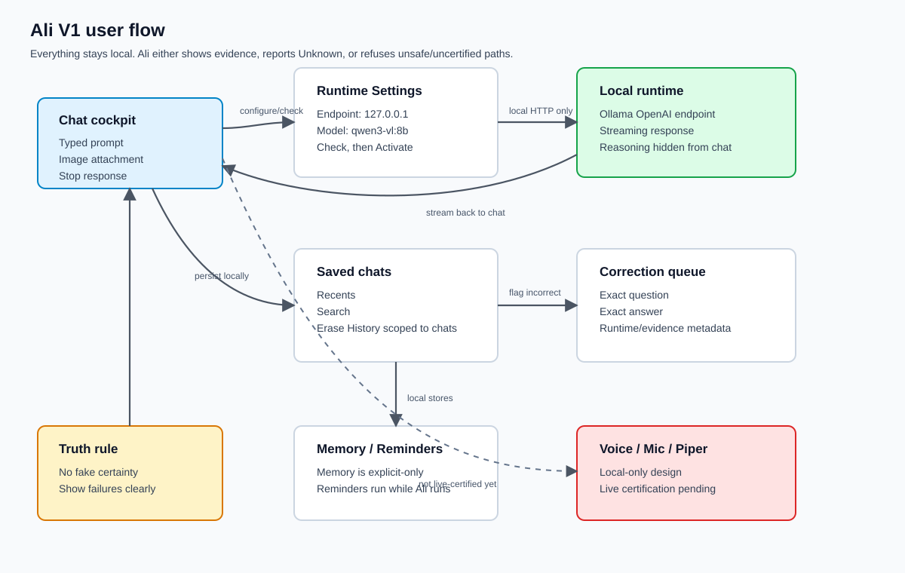

# Ali User Guide

## Current Bootstrap

Ali currently opens as a WPF desktop app with Chat as the home base.

You can:

- Type in the composer.
- Press Enter to send.
- Press Shift+Enter for a new line.
- Paste a copied screenshot or image with `Ctrl+V`.
- Use `Paste Image` when the clipboard contains an image.
- Use `Capture Screen` to attach a full-screen screenshot.
- Preview and remove image attachments before sending.
- Check `Retain` on an attachment only when you want Ali to keep it after the current send.
- Use `Push to Talk` to start local voice recording.
- Use `Stop Recording` to stop recording and ask Ali to transcribe locally.
- Review or edit the transcript before clicking `Send Transcript`.
- Use `Stop Speaking` to stop local spoken playback.
- Stop an active response.
- Flag an assistant answer as incorrect.

The first runtime is a safe local bootstrap stub. It exists to prove the app flow and correction queue before a real local model is activated.

## Program Flow



This is the current V1 shape from a user's point of view: chat starts in the cockpit, runtime activation goes through Settings, local answers stream back into chat, and corrections/memory/reminders stay local. Voice is shown as local-only but not live-certified yet.

## Local Runtime Check

Ali can now be pointed at a local OpenAI-compatible runtime, such as Ollama running on this PC.


Ali does not silently switch. Use the Runtime Settings panel:

1. Set the endpoint, usually `http://127.0.0.1:11434/v1/`.
2. Select the installed model/package ID exactly as the local runtime reports it.
3. Keep conservative development settings unless deliberately testing a larger profile.
4. Click `Check`.
5. Click `Activate` only after the check passes.

If the check fails, Ali keeps the safe bootstrap stub active and reports the failure.

Ali refuses public/cloud runtime endpoints in local-only mode.

Use `Revert to Stub` any time you want to return to the deterministic local test runtime.

The current certified local proof model is `qwen3-vl:8b` through Ollama's OpenAI-compatible endpoint. The development profile used for the latest certification was:

- Endpoint: `http://127.0.0.1:11434/v1/`
- Model: `qwen3-vl:8b`
- Quantization: Ollama package default / lowest Ali runtime settings
- Context: `2048`
- Output: `128`
- Temperature: `0`
- Top-p: `0.1`
- Streaming: enabled

`qwen3-vl:8b` can emit a separate Ollama reasoning stream before final answer content. Ali hides that reasoning in normal chat. If the model spends the whole low output budget on hidden reasoning, Ali reports that no visible assistant content arrived instead of exposing the reasoning text.

`qwen3:14b` was removed from this development machine to keep the system responsive.

## HTML Helper

Ali also has a small web helper for basic ask/answer access.

Default local launch:

```powershell
dotnet run --project .\src\Ali.App.WebHelper\Ali.App.WebHelper.csproj
```

Then open:

```text
http://127.0.0.1:8765/
```

For remote or LAN testing, bind deliberately and use an access token:

```powershell
$env:ALI_HELPER_URLS = "http://0.0.0.0:8765"
$env:ALI_HELPER_TOKEN = "choose-a-local-test-token"
dotnet run --project .\src\Ali.App.WebHelper\Ali.App.WebHelper.csproj
```

The helper serves one HTML page for basic chat, recent history, and runtime error reporting. It uses Ali's existing local runtime settings and tries to activate the configured local runtime on first ask. If the local runtime check fails, the helper returns the failure instead of silently using the stub as if it were the real model.

The helper lists the last 20 conversations from the current local Ali profile. This is not a personal-account or multi-user system; anyone with access to the same helper/profile can see the same helper history. If `ALI_HELPER_TOKEN` is configured, ask and history endpoints require that token.

The helper includes a local Programming Companion panel for deterministic Ali coding commands. The helper keeps recent chat history on the left, chat in the center, and the Programming Companion on the right. It lists common programming skills, fills a command line from grouped command buttons, and sends commands through the loopback coding bridge. The bridge endpoints are loopback-only and still route through Ali's existing coding parser, workspace policy, confirmation gates, and receipts. This is a local companion surface for future Visual Studio integration, not a Visual Studio extension.

The helper does not add cloud fallback, voice, user-isolated accounts, or direct ungated file authority. Personal accounts and separated conversation history belong to a future hosted/multi-user product scope.

## Coding Assistant

Ali can help with coding work inside the approved local programming workspace.

Current default workspace:

```text
C:\Users\clsor\Documents\Programming Projects
```

Use Settings -> Permissions to review or change the approved workspace, file-open behavior, edit gates, build/test/run gates, and Git gates.

Useful commands:

- `inspect coding workspace`
- `show project map`
- `analyze solution architecture`
- `explore build idea SolidWorks BOM helper`
- `draft implementation roadmap Visual Studio tool window`
- `show pending roadmap`
- `approve last roadmap`
- `start approved roadmap`
- `show active roadmap step`
- `mark roadmap step complete`
- `recover roadmap state`
- `show crash recovery status`
- `show visual studio integration`
- `generate visual studio integration plan`
- `list packages`
- `confirm dotnet add package "CommunityToolkit.Mvvm" to "C:\path\to\project.csproj"`
- `search workspace for WidgetFactory`
- `read file "C:\path\to\file.cs" at line 42`
- `plan coding task fix the build`
- `show coding receipts`
- `suggest patch from last failure`
- `generate pdf "owner-demo.pdf" with text "Ali demo ready."`
- `generate coding report`

Guarded patch workflow:

1. Ask Ali to plan the task.
2. Ask Ali to preview the exact text change:

```text
preview replace in file "C:\path\to\file.cs" "old text" with "new text"
```

3. Review the preview.
4. Use `show pending patch preview` if you need to see the pending patch again.
5. Use `discard pending patch preview` if the patch is not wanted.
6. Use `confirm apply last patch preview` to apply the last valid preview.
7. Use a confirmed build/test command after the edit.

Ali rechecks the pending patch before showing or applying it. If the file changed and the preview is stale, Ali discards the pending patch instead of applying an old change.

Multi-file patch bundles use the same preview and confirmation flow:

```text
preview patch bundle
file "C:\path\to\first.cs" replace "old text" with "new text"
file "C:\path\to\second.cs" replace "old text" with "new text"
```

Patch bundles are limited to exact literal replacements inside the approved coding workspace. Ali allows up to eight edits in a bundle, including multiple sequential edits in the same file. Ali rechecks every edit before applying anything and writes only after the whole bundle validates. Use `confirm apply last patch preview` only after reviewing the preview.

Build and diagnostic workflow:

- Build/test/run/restore/package-install commands require confirmation.
- Use `confirm dotnet add package "Package.Id" to "C:\path\to\project.csproj"` to install a NuGet package into a project.
- Use `confirm dotnet build "C:\path\to\project-or-solution"` to run a guarded build.
- If a build or test fails, use `diagnose last build failure`.
- Use `open build error` to open the first diagnostic file at the reported line.
- Use `suggest patch from last failure` for narrow deterministic preview-only fixes. This currently supports simple `CS1002 ; expected` diagnostics by previewing a semicolon addition at the reported source line. It does not apply the change unless you review the preview and use `confirm apply last patch preview`.

Git workflow:

- Read-only commands such as `git status`, `git diff`, and `git log` are allowed when Git permissions are enabled.
- `git add`, `git commit`, and `git merge` require confirmation and follow the configured Git permission gates.
- Use `confirm git add all` and then `confirm git commit "message"` when you want Ali to write a commit.
- `git pull` and `git push` remain blocked unless network Git operations are deliberately enabled later.

Ali does not silently change files, run builds, restore packages, or write Git history. Tool results are recorded as coding receipts so Ali can report what actually happened.

Use `generate coding report` to export a local PDF summary of the current coding workspace, recent coding receipts, pending patch preview state, and last failed dotnet command if one is stored. The report is saved in Ali's generated documents folder.

`analyze solution architecture` is read-only. It reports solutions, projects, target frameworks, project roles, project references, package references, source-file counts, a project dependency graph, and an estimated build order.

`explore build idea ...` is read-only. It helps compare implementation paths, library/software areas to research, and approval checkpoints for a proposed build. Library names are exploration candidates only; Ali needs an approved internet/package lookup before treating versions or ecosystem state as current.

`draft implementation roadmap ...` is read-only. It expands a goal into architecture fit, phases, likely impact surface, test strategy, risks, definition of done, approval checkpoints, and safe next commands.

Roadmaps can be kept as pending planning state. Use `show pending roadmap`, `approve last roadmap`, `start approved roadmap`, or `discard pending roadmap`. Starting an approved roadmap begins a guided phase loop and proposes the next safe action. It does not silently edit files, install packages, run builds/tests, or write Git history.

Roadmap execution state is saved under Ali's local coding data. Use `show active roadmap step`, `mark roadmap step complete`, `pause roadmap`, `resume roadmap`, `finish roadmap`, or `recover roadmap state` to continue after interruption or crash. Recovery restores the roadmap goal, status, current step, and last receipt snapshot; it does not replay commands.

Use `show crash recovery status` after a crash or interrupted build. Ali reloads the roadmap state, checks recent coding receipts, runs a read-only Git status check, compares the active roadmap step against receipts, and suggests safe continue/fix/rollback paths. If the evidence supports a concrete fix, Ali can suggest a guarded patch preview for approval; if the evidence is unclear, she should pause and show options before editing.

Visual Studio integration in this build now includes a developer VSIX named `Ali Companion`. The extension adds a native `Ali Companion` tool window in Visual Studio with command buttons, command history, a command box, progress/state cues, run timing summaries, pending-approval summary, an output pane, a diagnostics list, and a Visual Studio context strip. It can read the active solution path, active document path, current line, and selected text, then fill deterministic Ali commands such as read active file, build active solution, search selection, plan from selection, and preview replace selection. It calls Ali's loopback coding bridge at `http://127.0.0.1:8765/api/coding/*`; the helper still owns the coding command parser, workspace policy, confirmation gates, and receipts. Configure helper URL, history length, and selected-text behavior under `Tools -> Options -> Ali -> Companion`.

Use `generate visual studio integration plan` to produce a deterministic handoff for deeper phases. The handoff reports the current workspace, launcher discovery, architecture snapshot, and the minimum guarded contract the VSIX must keep following.

The HTML helper's Programming Companion panel remains available in the browser. The VSIX uses native Visual Studio controls instead of embedding that page, which avoids legacy embedded-browser rendering and script issues. Both surfaces submit deterministic coding commands to Ali on loopback, and all writes/builds/tests/Git actions still follow the same confirmation gates. Context buttons fill the command box; they do not silently edit files or run builds without Ali's normal command handling.

The VSIX build output is:

```text
src\Ali.App.VisualStudioExtension\bin\Debug\net472\Ali.App.VisualStudioExtension.vsix
```

Install it into Visual Studio Community with Visual Studio's VSIX Installer, then open `View -> Ali Companion`. Start the WebHelper before using the window. The tool window can also open the browser helper separately with `Open Helper`:

```powershell
dotnet run --project .\src\Ali.App.WebHelper\Ali.App.WebHelper.csproj --no-build
```

Visual Studio can also call the current bridge through `Ali.App.VisualStudioBridge.exe`, which is designed for Visual Studio External Tools. Build the solution, start the WebHelper on loopback, then add an External Tool that points at:

```text
src\Ali.App.VisualStudioBridge\bin\Debug\net10.0\Ali.App.VisualStudioBridge.exe
```

Example External Tools arguments:

```text
--status
--handoff
--list-external-tools
--preset recovery
--preset build --solution "$(SolutionPath)"
--command "analyze solution architecture"
--read-current-file --file "$(ItemPath)" --line "$(CurLine)"
--command "read file \"{file}\" at line {line}" --file "$(ItemPath)" --line "$(CurLine)"
```

The External Tools bridge remains useful for one-click commands, even with the VSIX installed.

The full External Tools setup guide is at:

```text
tools\visualstudio\ALI_VISUAL_STUDIO_EXTERNAL_TOOLS.md
```

The Visual Studio plugin polish backlog is tracked at:

```text
docs\ALI_COMPANION_PROFESSIONAL_PLUGIN_BACKLOG.md
```

The bridge tries to start Ali's local WebHelper automatically when it is offline. Use `--no-start-helper` if you want Visual Studio to fail fast instead.

The bridge is not tied to Insiders. If you switch to regular Visual Studio Community later, add the same External Tools entries in that Community instance and point them at the same bridge executable.

## Voice

Phase 1C voice is local-only.

Ali records a temporary WAV file from the selected local microphone. The raw audio is deleted after transcription unless a retention setting or validation flag explicitly keeps it.

The current local voice resources live under Ali's own `lib\voice` folder:

- `lib\voice\python-venv`
- `lib\voice\whisper`
- `lib\voice\piper`

For this developer build, configure the local speech environment from:

```powershell
.\tools\voice\ALI_LOCAL_VOICE_ENV.example.ps1
```

Ali uses a local Faster-Whisper wrapper for STT and a local Piper wrapper for TTS. The STT wrapper writes confidence metadata and rejects suspicious no-speech/low-confidence segments instead of turning noise into a command.

Installed local proof resources: 26 en-US Piper voices and Faster-Whisper caches for `tiny.en`, `base.en`, `small.en`, `medium.en`, and `large-v3`.

If local STT or TTS is not configured, Ali says so in the voice status area. She does not use cloud speech and does not pretend a transcript or spoken response succeeded.

The voice settings popup includes:

- Microphone picker
- Channel picker
- Gain control
- Live input meter
- Capture diagnostics
- Piper voice picker and sample playback

The main chat surface is chat-first: conversation list on the left, conversation content in the center, and one bottom composer for typed text, image attachment, mic dictation, hands-free voice mode, stop response, and send.

The composer mic records local speech and places the accepted transcript into the chat bar. It does not send until Enter or Send is pressed. The voice mode button toggles hands-free behavior, where accepted transcripts are sent automatically. Risky command transcripts still require visible confirmation and are blocked in this phase.

Meter states:

- `No speech signal detected`: selected mic is silent, muted, or not receiving signal.
- `Input is too quiet`: Ali hears something, but STT may not be reliable.
- `Input level looks usable`: good candidate for live certification.
- `Input is clipping`: lower gain or choose a calmer preset.

Input presets:

- `Raw`: minimal processing.
- `Quiet Room`: light cleanup and moderate gain.
- `Noisy Room`: stronger gate/noise suppression.
- `Broadcast Mic / Close Mic`: close microphone shaping.
- `Headset Mic`: practical boosted default for headset-style mics.

Voice settings persist in `%LOCALAPPDATA%\Ali\BootstrapData\voice-settings.json`. If a saved mic disappears, Ali shows a warning and falls back visibly instead of silently pretending the same mic is still active.

Current voice certification status: live voice, microphone, Piper playback, and Stop Speaking are not certified in the current V1 runtime pass. Chris must be present for that hardware/audio certification. Logic-level safety tests exist, but that is not the same as live voice certification.

Voice can ask ordinary chat questions. Voice cannot yet run commands, change models, edit calendars, install things, delete memories, or do destructive actions. Those spoken requests are blocked in this phase and require visible typed confirmation later.

## Important Truth Rule

Ali must not claim a model, command, build, test, reminder, calendar event, or file change succeeded unless there is evidence.

If Ali does not know, she should say so.

## Correction Queue

Use `Flag as incorrect` when an answer is wrong or unsupported.

Ali preserves:

- The exact question
- The exact answer
- Model profile metadata
- Evidence status
- The correction category
- Voice transcript and local STT/TTS metadata when the answer came from voice

The original answer is not rewritten.

If the flagged answer used a screenshot or image attachment, Ali routes it as a screenshot/image misread correction.

Raw voice audio is not stored in the correction queue.

## Coming Next

- Installer-managed signing/repair so Smart App Control accepts refreshed Ali binaries without manual certificate work
- Owner visual review
- Live voice/mic/Piper certification with Chris present
- Real local Whisper/Piper install picker
- Source/search controls
- Memory controls
- Backup and restore
- Simple installer with repair mode
