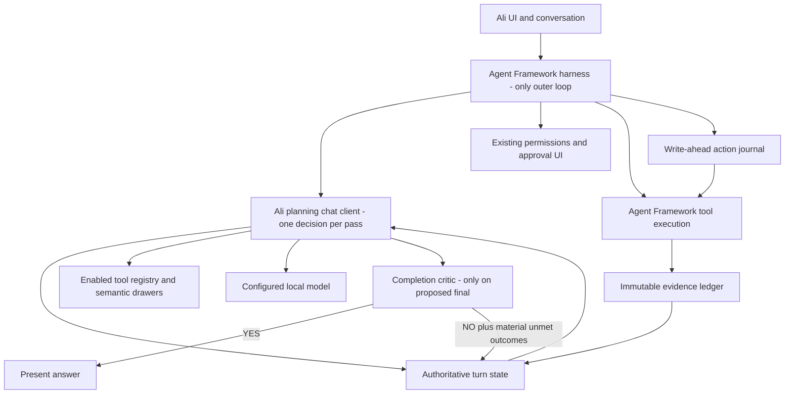
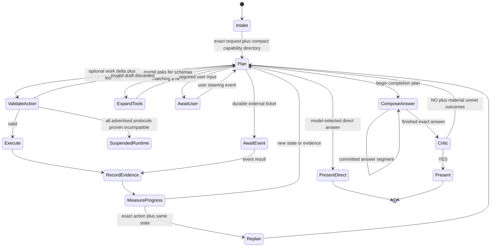

# Ali Orchestration Loop V2

Status: living target architecture. The checkpoint-6 durable planner, state, evidence,
runtime-admission, completion-publication, and production outcome-contract foundations are wired
into the running harness. Later-phase features called out below remain target design until their
checkpoint lands; passing source tests is not a claim of live provider, hardware, or UI proof.

For the exact checkpoint-6 implementation boundary and deferred-work list, see
`docs/reviews/CP6-EXTERNAL-READ-ONLY-REVIEW-BRIEF.md`. Where this target document and executable
code differ, the mismatch must be reported rather than silently assuming either is complete.

## Purpose

Ali needs one durable orchestration loop that can answer small conversational turns quickly and continue very large jobs for as many advancing steps as necessary. The model remains in charge of meaning, decomposition, tool choice, and completion, while model mistakes, invalid drafts, stale edits, and lossy summaries are prevented from becoming the next pass's authoritative truth.

This design replaces the growing responsibilities in `AliToolCallingChatClient` without replacing Microsoft Agent Framework. Agent Framework remains the one outer execution loop and continues to own sessions, approval prompts, registered-tool invocation, Agent Skills, and framework middleware.

## Required outcomes

1. One user-facing personality and one active orchestration loop.
2. No Aider, OpenHands, Open Interpreter, hybrid executor, or external coding-agent ownership inside Ali.
3. The model decides what the request means, whether decomposition is needed, which enabled tool is appropriate, and whether more work remains.
4. User-disabled capability groups never enter the callable registry or schema context. A compact availability manifest may say that a group exists but is disabled so Ali does not falsely claim the capability is absent.
5. Semantic tool retrieval reduces context without hiding necessary enabled capabilities.
6. C# work exploits Roslyn code actions and semantic transformations instead of repeatedly regenerating source text.
7. Invalid model output never enters authoritative task state.
8. Failed or stale mutations never silently become source truth.
9. Tool results remain immutable evidence; model prose never overwrites evidence.
10. The loop is unbounded while state advances. It replans exact non-advancing actions rather than imposing an arbitrary global iteration limit.
11. The critic runs only when the planner proposes completion, not after every intermediate step.
12. A completion is shown only after semantic acceptance or conclusive evidence that the outcome is impossible under available authority and resources.
13. Every visible status line explains what just happened and what Ali chose to do next.
14. Context and output settings remain exactly what the user selected. Context projection fits requests to that budget without changing the settings.
15. Agent Framework's accumulated transcript is transport history, not a second planner memory. Only accepted state, evidence, and explicitly selected conversation enter a later planning pass.
16. One canonical capability registry drives Settings, presets, native tools, language providers, semantic drawers, MCP exposure, capability reports, and critic visibility.
17. Side effects are write-ahead journaled and reconciled after interruption so a crash cannot cause a blind duplicate send, purchase, deletion, launch, or file mutation.
18. Existing specialist agents, group chat, sequential workflows, and Magentic managers do not retain private orchestration loops. Reusable expertise becomes Agent Skills or single-pass recipes used by the one planner.

## Honest guarantee

No probabilistic model can be guaranteed never to make a mistake. This design guarantees the useful property: a mistake cannot silently become authoritative merely because the model said it, and the same unchanged mistake cannot accumulate through every later pass. Only validated decisions, successful mutations, explicit failures, user decisions, and versioned evidence advance state.

## Ownership



Agent Framework owns iteration and execution. The planning client never runs a second autonomous agent loop. Each planning-client call computes exactly one next transition from a fresh projection of authoritative state.

### Agent Framework transcript boundary

The harness may retain messages for transport, streaming, and UI history, but `AliOrchestrationPlanningClient` does not serialize that accumulated transcript back into the planner. An `AliStateBackedChatHistoryAdapter` supplies a fresh synthetic message list for every accepted transition while retaining the stable Framework correlation/session needed for approval suspend/resume, telemetry, and UI streaming. It constructs the model request from the immutable original request, accepted steering events, current state revision, enabled capability snapshot, and selected evidence. Framework compaction, file-memory summaries, rejected model text, malformed decisions, abandoned continuations, raw tool payloads, and critic prose cannot enter planner state.

Accepted tool calls are write-ahead journaled before execution. Their results are committed to the evidence ledger before the harness requests another planner decision. The planner receives accepted calls and results only through that ledger projection. This removes the hidden two-state-system failure in which Agent Framework remembers a draft that Ali deliberately rejected.

Prior user turns may be selected as immutable conversational input. Prior assistant prose is labeled non-authoritative conversation context and cannot satisfy work, establish a fact, or replace cited evidence. If an earlier answer has retained evidence receipts, the projector references those receipts rather than treating the answer's wording as truth.

## Authoritative turn state

`AliTurnState` is isolated by active user, conversation ID, and assistant message ID. Each instance is an immutable revision; revision history is append-only during a visible turn, while validated planning hypotheses can be superseded by a later revision.

```csharp
internal sealed record AliTurnState(
    TurnIdentity Identity,
    UserObjective Objective,
    ToolAvailabilitySnapshot Availability,
    IReadOnlyList<WorkItem> WorkGraph,
    IReadOnlyList<EvidenceReference> Evidence,
    IReadOnlyList<AttemptRecord> Attempts,
    IReadOnlyList<ActionIntentReference> ActionJournal,
    IReadOnlyList<UnmetOutcome> UnmetOutcomes,
    ProposedCompletion? ProposedCompletion,
    TurnControlState Control,
    long Revision);
```

The original user text, accepted follow-up constraints, and relevant conversation references are immutable inputs. A model may propose a semantic objective or work-graph delta, but it cannot rewrite the original request.

### Work graph

The model may decompose a request into dependent work items. Decomposition is not generated by keyword rules. The work graph is an accepted, revisable planning hypothesis, not evidence that the work is true or complete. A work item records its model-written outcome, semantic status, dependencies, satisfying evidence, and last selected action. The graph may grow to any practical size. It is stored outside the prompt and projected as the active branch plus a compact list of remaining outcomes.

Every proposed delta passes structural validation before it is stored:

- IDs are stable and unique, and dependencies form an acyclic graph;
- the original objective and user constraints cannot be deleted, rewritten, or satisfied by assertion;
- every cited evidence ID must resolve to evidence bound to that exact work-item ID, even while the item is pending or active;
- a work item cannot become satisfied, impossible, or superseded without exact-bound successful evidence that supports that status;
- satisfied history and unmet critic outcomes cannot silently disappear; they may be resolved, revised, or superseded only with provenance and supporting evidence;
- a mistaken decomposition may be revised or replaced while the original request remains authoritative; and
- final completion is checked against the original request, not merely against the model's decomposition.

### Evidence ledger

Every executed tool produces an immutable `EvidenceEntry` containing:

- tool name and registered capability group;
- validated arguments or protected digest;
- timestamps and outcome;
- full structured result in local storage;
- compact model projection;
- affected artifact identifiers;
- before and after hashes or versions;
- execution and permission receipts;
- source freshness, trust boundary, and provenance when applicable; and
- a no-effect/failure fingerprint that excludes timestamps and other incidental noise.

Invocation status and domain outcome are separate. `InvocationStatus=Returned` does not imply `OutcomeStatus=Succeeded`; a tool may return normally with `success:false`, no result, rejected permission, or a domain failure. Tool adapters normalize both fields before evidence can satisfy a work item.

Every canonical production task tool has a versioned outcome contract. Ali-owned tools classify an
exact CLR result type; Framework tools with ambiguous model-facing returns require an exact
provider-boundary signal correlated by durable turn identity, call ID, and canonical tool name.
Missing, mismatched, conflicting, evicted, untrusted external, or otherwise unverifiable outcomes
remain `Unreported`. Generic JSON properties and prose are never inspected to promote success.

A caller-supplied stable evidence ID is idempotent only when the complete protected invocation
identity still matches: work item, effect kind, canonical artifacts, source, arguments, normalized
target/effect, permission, result/outcome, and normalized UTC timestamps. Rebinding any field is
rejected rather than returning the older receipt.

The model cannot edit the stored evidence. Retrieved web pages, MCP results, documents, and command output are explicitly framed as untrusted data rather than instructions. Secrets and protected arguments are stored only in the existing protected secret facility; checkpoints, model projections, activity, and ordinary logs contain redacted values or digests.

Context projection may select evidence and mechanically shorten display text, but it never elides invocation status, domain outcome, freshness/provenance, target versions, affected-artifact IDs, permission state, or no-effect/failure fingerprint. The complete entry remains retrievable by ID through typed, paged evidence-inspection tools with stable cursors.

### Write-ahead action journal

Before any side-effecting tool runs, Ali durably records an `ActionIntent` containing the turn/state revision, work item, live tool identity, canonical argument digest, target versions, permission receipt, and idempotency/correlation key. Execution then has three durable states: `Prepared`, `Committed`, or `InDoubt`.

If Ali or Windows stops after the side effect but before the receipt is committed, resume reconciles the in-doubt intent with the target system before planning continues. A file operation compares hashes and transaction manifests; a process operation checks the recorded process/artifact identity; an external service uses its request ID or provider reconciliation endpoint. If an effect cannot be proven either applied or absent, Ali asks for a user decision instead of blindly repeating it. Ordinary retries reuse the same idempotency key.

One transition writer owns each active turn. Revision compare-and-swap prevents a late tool completion, background memory job, settings event, or second UI callback from committing against stale state.

## One-pass decision contract

Each planner pass returns one typed envelope. The only model-facing planning function is the non-disableable protocol function `submit_orchestration_decision`. Its dynamically generated schema contains the optional work-graph delta, declared material claims, and a discriminated next-action union. The `CallTool` branch embeds `oneOf` schemas only for the currently selected task tools.

`AliOrchestrationPlanningClient` intercepts that protocol call, validates the whole envelope, commits an accepted work delta, and converts an accepted `CallTool` into the real registered `AIFunction` call that Agent Framework executes. The work delta travels as validated state associated with the call ID; it is never recovered from assistant prose. Non-tool actions become typed state transitions. A compatibility backend emits the exact same envelope schema, but an invalid envelope is discarded rather than partially parsed.

```csharp
internal sealed record OrchestrationDecision(
    WorkGraphDelta? WorkUpdate,
    IReadOnlyList<DeclaredClaim> MaterialClaims,
    OrchestrationAction NextAction);

internal abstract record OrchestrationAction
{
    internal sealed record CallTool(
        string ToolName,
        IReadOnlyDictionary<string, object?> Arguments,
        string Need,
        string ExpectedProgress) : OrchestrationAction;

    internal sealed record ExpandTools(string Need) : OrchestrationAction;

    internal sealed record AnswerDirectly(string Answer) : OrchestrationAction;

    internal sealed record RequestUserInput(
        string Question,
        string MissingInformation) : OrchestrationAction;

    internal sealed record AwaitExternalEvent(
        string TicketId,
        string WaitingFor) : OrchestrationAction;

    internal sealed record BeginCompletion(
        CompletionPlan Plan) : OrchestrationAction;
}
```

`AnswerDirectly` is the model-selected one-pass route for a conversational or stable-knowledge response whose declared material-claim list is empty. It does not visit the critic. Any declared current-evidence, performed-action, artifact, permission, file, code, or completion claim requires `BeginCompletion`. The validator can enforce the declaration contract but cannot mathematically prove that a probabilistic model did not omit a claim; that residual fast-path risk is explicit and covered by adversarial regression traces rather than hidden behind string rules. `RequestUserInput` is valid only when a concrete missing user decision or datum prevents any useful next action. `AwaitExternalEvent` requires a real tool-issued ticket and suspends without polling in a hot loop.

There is no `give up`, arbitrary retry-count blocker, or external-agent delegation action. A `CompletionPlan` contains `CompletionKind`, required outcome/claim IDs, their evidence bindings, requested format/sections, and an answer ID; it does not carry a potentially huge final answer. `CompletionKind` is `Succeeded` or `ProvenImpossible`. Proven impossibility requires conclusive evidence IDs and is reviewed by the same critic as success.

### Typed answer composition (checkpoint-8 target)

Checkpoint 6 uses an admitted, exact-runtime-bound, tool-free completion composer whose complete
answer is accepted only on a non-empty `Stop` result; partial or incompatible output never enters
the final journal. Checkpoint 8 will extend that safe publication boundary with the paged,
hash-chained composition protocol below for answers too large for one admitted response.

After a valid `BeginCompletion`, the target `AliFinalAnswerComposer` uses a second non-disableable protocol function with only two actions:

```csharp
internal abstract record AnswerCompositionAction
{
    internal sealed record AppendSegment(
        string AnswerId,
        int Sequence,
        string PreviousSegmentHash,
        string Text,
        IReadOnlyList<string> CoveredClaimIds) : AnswerCompositionAction;

    internal sealed record FinishAnswer(string AnswerId) : AnswerCompositionAction;
}
```

Every complete segment is hash-chained and committed before the next is requested. A clipped or malformed segment envelope is discarded and regenerated from the last committed sequence; it never seeds continuation. The composer sees the completion plan, remaining claim/section checklist, evidence projections, and only the necessary prior tail. A short answer normally completes in one segment. `FinishAnswer` is valid only when every required outcome/claim has coverage, after which the exact stored pages go to the critic.

## State machine



Pause, cancel, and mid-turn steering are control-plane events, not guessed from English by string rules. Stop/cancel first sets a durable control flag, propagates the cancellation token to the active adapter, and prevents the next side effect. Any external effect that may have crossed the cancellation boundary is reconciled from its prepared intent. A new user message is stored verbatim as a steering event; the model decides whether it adds a constraint, supplies requested information, or changes the objective. A paused or interrupted turn can resume from the last committed revision. Late tool completions are recorded but cannot mutate a canceled or superseded revision.

## Preventing ever-increasing errors

1. **Rebuild prompts from truth.** Every planner prompt is rebuilt from `AliTurnState`. Invalid planner text, malformed JSON, abandoned continuation text, critic prose, and speculative explanations are never appended to later prompts.
2. **Separate proposal from mutation.** A model proposal cannot directly become a committed source mutation. Mutation tools validate arguments, authorization, target versions, and domain syntax first.
3. **Version mutable targets.** Preview/apply operations carry the observed input hash and fail as stale after a conflicting change.
4. **Prefer semantic transformations.** For C# symbols and syntax, the model selects an outcome and Roslyn action; Roslyn performs the syntax-tree change.
5. **Validate generated source before publication.** New C# is parsed in a temporary document. Existing files use recoverable changesets. Diagnostics and hashes become evidence.
6. **Never turn failure into capability absence.** A registered tool returning an error still exists. Exact compiler, lock, permission, connection, and process evidence remains alongside earlier successes.
7. **Never compact truth into model prose.** Full evidence remains outside the prompt and is retrieved by stable ID.
8. **Use transactions for source changes.** C#, XAML, project XML, JSON, web files, and other source artifacts are written to staged versioned changesets, parsed or validated there, and published through an all-or-reconciled logical transaction only after the requested pre-apply checks pass.
9. **Use typed objects inside the process.** Orchestration modules pass the records above directly. JSON is confined to model, MCP/IPC, and durable-storage boundaries and never becomes an unnecessary in-process source of parsing failure.
10. **Recover protocol shape without retaining bad content.** Native tool calling is tried first. A verified compatibility failure may fall back to selecting one action/tool and then supplying only that selected schema. Every fallback begins from the same authoritative state; no malformed draft is appended.

## Progress semantics

The loop has no ordinary global step limit. Progress is mechanical and independent of English wording. An action identity combines:

```text
enabled-registry revision
+ work-item ID
+ tool name
+ canonical argument digest
+ relevant target-version digest
+ permission state
```

The same action is allowed again when its target, arguments, permission, dependency state, or external evidence changed. The exact same action against the exact same state is not executed again. It becomes non-advancing evidence and the model receives a fresh planning pass with the prior result and unmet outcome.

Action identity is necessary but not sufficient. A `ProgressVector` also records evidence-backed outcome coverage, validated artifact versions, diagnostic/test changes, unresolved permissions, and normalized no-effect/failure fingerprints. A new timestamp, differently worded explanation, alternate tool with the same no-effect result, failed mutation, repeated tool expansion, or identical completion/critic denial is not progress. Progress exists only when validated state relevant to an unmet outcome changes.

This prevents dead loops without blocking legitimate repetition across different files, pieces, targets, source revisions, approvals, or external state. When different actions repeatedly produce the same no-effect fingerprint, the active planning hypothesis is reopened for decomposition instead of merely choosing synonyms. Transient connector recovery remains separate and preserves the existing retry policy.

## Tool availability and context control

`AliCapabilityRegistry` is the single source of capability metadata. Each descriptor carries a stable group/tool/provider ID, user-facing name and description, callable schema factory, language-provider membership, prerequisite groups, preset memberships, permission policy, semantic-search text, capability-report visibility, MCP exposure policy, `EffectKind`, idempotency support, reconciler identity, and mutation boundary. Settings rows and presets are generated from these descriptors rather than maintained as separate lists. Native functions, Agent Framework built-ins, Agent Skills, language providers, and incoming MCP tools must all register descriptors; none may bypass the checkbox boundary through a separate collection. Unknown MCP tools remain quarantined and non-callable until group, risk/effect, permission, and reconciliation metadata are assigned.

The persisted checkbox table is authoritative. Presets apply explicit additive checkbox changes; prerequisites never silently enable a group behind the user's back. A selected tool whose declared prerequisite is disabled is unavailable with a truthful explanation. Initial groups are:

- Files and archives
- Programming core
- C# / .NET / Roslyn
- Python
- HTML / CSS / JavaScript / TypeScript
- Java
- Native C / C++ / GCC
- Arduino
- Raspberry Pi
- DevOps / architecture / quality
- Visual Studio

Presets are additive. C#, Java, Arduino, and File Tools presets check their required rows; users may customize every row afterward. Office groups can be added later without changing orchestration.

The Settings table is generated from the registry and shows `Enabled`, `Capability`, `Description`, `Effective status`, and `Callable tool count`. Presets are combinable and visibly change the same checkboxes; after applying a preset the individual rows remain editable. Saving displays the new registry revision and never changes an unshown row.

Disabled groups are removed before Agent Framework receives the callable registry. Their schemas, providers, semantic entries, MCP tools, and critic tool inventory are absent. A compact enabled/disabled group manifest remains visible so Ali can say that Python is disabled rather than falsely saying Python tools do not exist.

Availability is frozen by active user, turn, and revision for each planning decision. Immediately before execution, the harness compares the pending action to the live capability/permission revision. A tool disabled or disconnected mid-turn cannot execute; the pending action is invalidated and the planner receives the new snapshot. Resume performs the same check. Semantic indexes are keyed by the canonical registry fingerprint, so a descriptor or checkbox change cannot leave a stale drawer behind. Candidate snapshots are turn-scoped; no process-global `latest tools` collection may leak one user's or turn's registry into another.

Semantic retrieval is a candidate generator, not a decision-maker. The initial planner pass receives the compact capability directory and no embedding query is performed merely because a turn began. Only the model's `ExpandTools(Need)` asks the resolver for schemas. Retrieval receives only enabled tools and is hierarchical: compact group directory, relevant drawer, then individual schemas. The planner chooses a returned schema or asks to expand tools for a semantic need. Once authoritative inspection identifies `dotnet-roslyn`, the C# / .NET / Roslyn drawer remains visible for that work branch. This exposes schemas without forcing a call.

Qdrant updates are fingerprinted, versioned, and swapped atomically; a live collection is never deleted and recreated underneath another turn. A failed embedding endpoint leaves the revision-scoped compact directory available without replacing it with a process-global full-registry fallback.

If embedding or Qdrant retrieval is unavailable, fallback supplies the complete compact directory of enabled groups plus the `ExpandTools` action. The model chooses a group from that directory, and the next pass receives that group's schemas. Fallback never floods the prompt with every schema and never exposes a disabled group.

Metered limits, exact-query suppression, and external-action policies remain explicit user-visible permission/budget controls. They are enforced independently of task progress, so an unbounded advancing job cannot silently become unbounded spending.

Effective MCP exposure is the intersection of enabled capability group, MCP-server policy, runtime registration, active-user permissions, and transport readiness. Incoming MCP descriptors declare their group and risk metadata. The headless MCP host enforces the same actor, path, permission, and approval policy as the desktop harness for mutation and execution tools; a client cannot bypass Ali's permissions by calling Roslyn apply, file mutation, process execution, or another dangerous tool through the server directly.

The canonical registry has two tiers. A tiny orchestration protocol tier contains decision submission, tool expansion, state/evidence paging, answer composition, and turn control. These are integrity plumbing, not user task capabilities, are always present, and cannot be disabled. Every ordinary file, coding, web, office, language, Framework, Skill, or MCP capability remains in the user-controlled task tier.

## Provider-neutral runtime and optional vision (checkpoint-9 target)

The orchestration core binds an immutable model-dispatch snapshot, not a Lemonade-, LM Studio-,
Ollama-, llama.cpp-, or vendor-named client. Provider adapters expose the same concrete client,
profile/model identity, context/output limits, generation settings, protocol capabilities, and
health evidence. Changing the provider dropdown changes the adapter selected for a future pass; it
does not rewrite durable work/evidence or redirect an already authorized call.

Supported runtime families include local Lemonade, LM Studio, Ollama, and llama.cpp endpoints plus
an explicitly selected OpenAI-compatible HTTPS endpoint hosted on the internet. Remote endpoints
must require HTTPS, normal certificate validation, explicit user selection, bounded timeouts, and
secret-store API-key handling. Provider discovery cannot silently send a request, attachment,
evidence payload, or source file to a remote host.

Model capabilities use a tri-state observation such as `Supported`, `Unsupported`, or `Unknown`
with provenance and freshness. Vision discovery may notify the user when a trusted endpoint/model
probe confirms support. An unknown or failed probe does not disable the manual Vision checkbox.
When Vision is enabled, a compact attachment control appears beside the input and pasted
screenshots create removable previews; when no image is attached, the ordinary
text/tool/orchestration path is unchanged. Attached image bytes are admitted into the exact
selected context budget, retained only under the existing temporary-data policy, and never become
evidence merely because a model described them.

## One orchestration loop means one orchestration loop

The V2 cutover removes `AliSpecialistAgentFactory` agents, `AliAgentWorkflowFactory` sequential/group-chat/Magentic managers, and their model-callable workflow tools from the active registry. They are not left behind as nested Agent Framework loops. Valuable researcher, office/artifact, software-engineering, and workflow guidance is retained as Agent Skills, recipe manifests, and capability descriptions consumed by Ali's one planner.

A recipe may propose a dependency graph or a preferred order of native tools, but it cannot execute, maintain a private transcript, declare success, or bypass the shared evidence, permission, progress, checkpoint, and critic contracts. This preserves the framework knowledge without preserving the competing brains that caused the same accumulation sickness.

## Durable checkpointing

Every accepted state transition, prepared action intent, evidence receipt, permission decision, work-graph delta, steering event, and critic verdict is appended to a checksummed write-ahead journal and flushed before a dependent side effect or planner pass begins. Periodic compact snapshots are written by temporary-file flush plus atomic replace. Large evidence is content-addressed and referenced rather than copied into every revision. A snapshot binds the active user, conversation/message IDs, assistant profile, configured model/runtime, exact generation settings, capability/schema/semantic-index revision, MCP endpoints/revision, permission leases, attachment/blob digests, answer-draft position, and artifact versions.

Resume loads the last valid snapshot, replays the journal, reconciles in-doubt actions, and revalidates user identity, enabled capabilities, permissions, standing approvals, artifact hashes, runtime/model identity, ephemeral MCP connections, attachments, and outstanding changesets before planning continues. Changed external state becomes new evidence. A different active user cannot inherit another user's turn. Ali never silently replays an approval-bearing action and never resumes an old checkpoint unless the user explicitly requests it.

Final UI/conversation publication is itself idempotent and journaled, so a crash after rendering cannot append the same assistant answer twice on resume.

Completed-turn retention is bounded by explicit archive/cleanup policy. Content-addressed evidence remains reachable from retained receipts, while superseded snapshots and unreferenced temporary changesets can be reclaimed without deleting user artifacts or personal memory.

## Roslyn Action Deck

The C# group exposes five high-power model tools:

1. `roslyn_inspect_target`
2. `roslyn_list_actions`
3. `roslyn_preview_action`
4. `roslyn_apply_action`
5. `roslyn_verify_changeset`

`inspect` resolves the solution, document, symbol, diagnostics, references, implementations, call relationships, and target version. `list` discovers applicable Roslyn code fixes and refactorings. A returned action handle binds provider identity, equivalence key, action title, diagnostic IDs, document/span, and exact solution/document hashes; title text alone is never an executable identity. `preview` runs an action in a temporary workspace and stores a semantic changeset including added, removed, renamed, and project documents. `verify` first runs Roslyn analysis, affected MSBuild targets, and the smallest relevant tests against that temporary workspace. `apply` publishes only a non-stale, approved changeset with a matching pre-verification receipt through the logical transaction below, then `verify` confirms the canonical workspace still matches the previewed result. Provider exceptions become evidence and cannot partially satisfy the work item.

Checkpoint 7 gives preview compilation its own class-level `AdhocWorkspace` manager. It clones the canonical project's parse/compilation options and resolves the target framework's reference assemblies explicitly (including the project's actual WPF and package references) instead of depending on whichever assemblies happen to be loaded in Ali's process. `MSBuildWorkspace` remains the canonical solution loader; the temporary `AdhocWorkspace` is a semantic-state isolation gate, not an operating-system security sandbox. If the exact target references cannot be established, verification fails closed and no changeset can publish. This is target-framework aware rather than hardcoded to .NET 8, 9, 10, or the framework used to build Ali herself.

Model-selected recipes describe semantic rename, compiler repair, refactoring, public API change, call-flow investigation, architecture change, and final delivery verification. Recipes are descriptions and dependency graphs, not English routers.

Roslyn is authoritative for C# semantics, but WPF delivery also changes XAML and project XML. A shared versioned changeset engine stages non-C# source, parses XML/JSON where applicable, invokes the appropriate language/LSP/Tree-sitter checks, builds the affected project, and publishes the complete multi-file transaction together.

`AliExecutionBroker` enforces the boundary for every descriptor with `EffectKind=SourceMutation`. Ali-owned Roslyn and file-publication primitives receive write access only to the staged workspace and manifest; canonical publication remains broker-only. A tool that cannot honor that logical staging boundary is not callable as a source mutation. Builds and reads are excluded while the brief canonical publish lease is held, and direct MCP invocation follows the same rule.

Before durable authorization, target capture is deliberately static: bounded no-follow source bytes, the selected root, exact arguments, executor identity, and required execution assets are bound without evaluating MSBuild, imports, SDK resolvers, property functions, analyzers, or generators. Those components may execute only after the exact durable grant. MSBuild, `dotnet`, custom SDK resolvers, imported project code, `UsingTask` implementations, and explicitly requested analyzers then run as trusted local project/toolchain code under Ali's process account. Checkpoint 7 is not a hermetic or low-privilege sandbox and does not claim to enumerate every transitive MSBuild input or prevent project-authored child code from accessing anything the Ali account can access. Ali-owned path primitives reject reparse points immediately before access, but an external child process can race a junction replacement. Adversarial repositories require a future low-privilege worker, private scratch tree, and OS-enforced read/write boundary.

Windows cannot physically replace multiple existing files in one atomic filesystem operation. The guarantee is therefore all-or-reconciled logical publication: acquire an exclusive mutation lease, verify preimage hashes, journal the ordered replaces, publish, verify, and roll back or resume from the manifest after interruption. A failed pre-validation leaves canonical files untouched; an interrupted publication cannot be mistaken for completion. A whole-directory/worktree swap may provide stronger isolation where a project layout supports it.

## Context projection

Runtime context and output values remain exactly the user's selected values. `AliContextProjector` computes an input budget from those values but never changes them.

When the backend exposes token-count/template/capability preflight, the budget is measured on the exact final serialized request there, including server-added chat template and grammar overhead. Otherwise the connector uses the matching local tokenizer/template and labels the count as an estimate. It includes the system prefix, Agent Framework/model envelope, selected schemas, projected evidence, attachments, tool-protocol overhead, reasoning reserve when applicable, and the exact selected output allowance. A stable system/tool prefix is kept byte-identical where possible so compatible backends can reuse prompt/KV cache; dynamic state is a bounded suffix.

No hidden safety margin changes the user's settings. If an estimate is rejected by the backend, the returned capacity/token arithmetic becomes authoritative evidence; optional projected material is paged out and the exact settings are retried. If the mandatory protocol and useful input still cannot fit, Ali reports that precise backend limitation.

Projection priority is:

1. identity, permissions, and protocol;
2. exact current request;
3. active work item and unmet outcomes;
4. selected enabled schemas;
5. relevant immutable evidence projections;
6. relevant stable identity and memory facts;
7. recent conversation;
8. inactive branches and older evidence references.

Material that does not fit stays in local state and remains retrievable through typed paged tools by ID. Large user documents or requests that cannot fit as one model input are ingested unchanged as immutable sources and analyzed in model-selected chunks; they are not silently truncated. If the selected context/output pair cannot physically contain even the mandatory protocol and one useful input projection, Ali reports the exact token arithmetic and backend limitation without changing either setting.

Tool planning and final-answer continuation use separate projections so long answers cannot corrupt task state. `AliAnswerDraftStore` assigns every answer segment an answer ID, sequence, previous-segment hash, and committed offset. A dropped continuation resumes from the last committed offset without repeating text or feeding a partial answer back into work state.

## Completion critic

The planner continues directly after tool results, begins typed answer composition when it believes the work is complete, and visits the critic only after `FinishAnswer`. The critic runs in a fresh stateless model request with no planner rationale, rejected drafts, or prior critic prose. It receives the exact original request and steering constraints, the fully composed user-visible answer, current planning graph, a claim-to-evidence coverage table, cited evidence, unresolved failures/permissions, and enabled capabilities relevant to remaining outcomes. Evidence IDs in the completion plan must resolve to existing ledger entries; invented or stale IDs fail validation before composition or criticism.

```csharp
internal sealed record CriticVerdict(
    bool Complete,
    string Basis,
    IReadOnlyList<string> MaterialUnmetOutcomes);
```

A `false` verdict appends the material unmet outcomes and returns control to the planner. Returning all material defects prevents one-at-a-time nitpicking while the top-level contract remains the simple question: complete, yes or no, and why. The same completion/evidence/verdict identity cannot run again without changed state. Critic prose never selects tools and never becomes evidence. Spelling or style cannot reject completion unless exact text was requested or the error changes material meaning. `AnswerDirectly` remains the model-selected fast path for social turns and stable knowledge with no action, evidence, current-fact, code, file, or completion claim.

If the exact final answer is too large for one critic request, immutable answer pages are audited against their covered claims and evidence. The final coverage pass receives the original objective/outcome checklist, every claim and evidence binding, per-page coverage, adjacent-page boundary summaries, page hashes, and page verdicts. It checks omissions, duplication, cross-page contradictions, and whole-request satisfaction rather than treating hashes as semantic proof. Only the exact pages that will be rendered can be approved.

The planner and critic use the user's selected reasoning effort. The orchestration layer does not secretly force the critic to low, high, or any other unreported value. A separate critic-effort setting may be added only if it is visible, persisted, and honored exactly.

Repeated malformed decision envelopes are fingerprinted. Ali tries the finite advertised protocol modes from a clean state; it does not retry the same malformed protocol forever. If every supported mode is proven incompatible, the turn enters `SuspendedRuntime` with exact technical evidence and a precise request to change or repair the configured model/protocol. It does not claim that the user's underlying objective is impossible. This is a runtime capability conclusion, not a task-step timeout.

## Human-readable activity

Each transition publishes one replaceable current line and one append-only detail entry:

```text
Ali inspected the solution -> selected Roslyn semantic rename -> previewing 14 affected references.
Roslyn previewed 3 files with no new diagnostics -> Ali is applying the approved changeset.
Build failed because TicTacToe.exe is running -> Ali selected stop project -> then she will rebuild.
Critic denied completion -> runtime launch evidence is missing -> Ali is selecting the next action.
```

Raw JSON and full technical results remain in logs, not in the human status line.

## Existing behavior preserved at the boundary

V2 changes decision ownership, not Ali's proven desktop behavior. The harness continues to preserve:

- bridge send, activity streaming, approve, deny, cancel, and reconnect behavior;
- vision/screenshot attachments and their temporary-data policy;
- permission/path guards and the existing Trusted Workstation profile;
- answer evidence status, provenance/source appendix, Copy, and Flag as incorrect;
- TTS only after the committed visible answer is available;
- private Framework file/work memory as retrievable data, never planner truth;
- recovery UI and checkpoint discovery; and
- background Mem0 review after the visible answer is committed.

Background Mem0, indexing, telemetry, and other post-turn jobs consume immutable snapshots. They cannot delay the visible answer or mutate the active turn revision. Their completed results become eligible context on a later planner pass or turn.

## Module boundaries

```text
src/Modules/Orchestration/
  AliOrchestrationPlanningClient.cs
  AliStateBackedChatHistoryAdapter.cs
  AliTurnState.cs
  AliTurnStateStore.cs
  AliTurnCheckpointStore.cs
  AliActionJournal.cs
  AliActionReconciler.cs
  AliTurnTransitionWriter.cs
  AliTurnControl.cs
  AliWorkGraph.cs
  AliWorkGraphValidator.cs
  AliEvidenceLedger.cs
  AliEvidenceProjector.cs
  AliEvidenceInspectionTools.cs
  AliCapabilityRegistry.cs
  AliCapabilityDescriptor.cs
  AliProtocolRegistry.cs
  AliToolAvailabilityResolver.cs
  AliSemanticToolResolver.cs
  AliDecisionValidator.cs
  AliExecutionBroker.cs
  AliProgressEvaluator.cs
  AliCompletionCritic.cs
  AliContextProjector.cs
  AliAnswerDraftStore.cs
  AliFinalAnswerComposer.cs
  AliProtocolFallback.cs
  AliActivityNarrator.cs
  Contracts/
    OrchestrationDecision.cs
    EvidenceEntry.cs
    CriticVerdict.cs
    ToolAvailabilitySnapshot.cs

src/Modules/Coding/RoslynActions/
  AliRoslynActionDeck.cs
  AliRoslynActionDiscovery.cs
  AliRoslynPreviewWorkspaceManager.cs
  AliRoslynChangeSetStore.cs
  AliRoslynChangeSetValidator.cs
  AliRoslynChangeSetVerifier.cs

src/Modules/Coding/Changesets/
  AliSourceChangeSetStore.cs
  AliSourceChangeSetValidator.cs
  AliSourceChangeSetPublisher.cs
  AliSourceChangeSetReconciler.cs
```

Capability modules remain separate. Orchestration does not absorb memory, web, files, coding, voice, identity, permissions, or MCP implementations.

## Migration checkpoints

1. **Contracts and shadow ledger:** add immutable state/evidence, invocation/outcome receipts, transition revisions, and observe the existing loop without changing decisions.
2. **Canonical availability boundary:** remove Aider/OpenHands/Interpreter ownership; generate checkbox groups and additive presets from descriptors carrying effect/reconciliation metadata; intersect native, Framework, Skills, language providers, MCP, permissions, reports, drawers, and critic inventory.
3. **Single-loop cut:** replace specialist agents, group chat, sequential workflows, and Magentic orchestration with Agent Skills/recipes; retain one Framework harness only.
4. **State-backed planning client:** replace the retained transcript, separate classifier call, and repair chains with model-first `Intake -> Plan`, one native `submit_orchestration_decision` envelope, one validator, clean protocol fallback, and fresh-state replanning.
5. **Journal and recovery:** add one transition writer, write-ahead action intents, idempotency, in-doubt reconciliation, answer publication receipts, and turn control.
6. **Progress and planning graph:** add validated model-authored work deltas, evidence-backed status, action/effect identities, and semantic no-progress recovery; retain unlimited advancing work.
7. **Transactional changesets and Roslyn Action Deck:** enforce source effects through the execution broker; implement inspect/list/preview/pre-verify/apply/post-verify plus non-C# staged all-or-reconciled publication.
8. **Completion hardening and regression:** add full backend-aware context/evidence paging, hash-chained answer segments, exact rendered-answer criticism, an isolated shadow-observation lane, fault injection, recorded regression traces, and long-running soak/property verification; delete superseded compatibility paths only after their cutover evidence passes.
9. **Provider, vision, deployment, and release cutover:** finish provider-neutral selection for LM Studio, Lemonade, Ollama, llama.cpp, and an explicitly configured secure remote OpenAI-compatible endpoint; add advisory vision discovery with manual override and conditional image attachment UI; clean runtime/deployment artifacts, repair the shortcut, publish the final architecture PDF, and complete live release verification.

### Current-to-V2 responsibility map

| Current responsibility | V2 owner |
|---|---|
| Separate coding-turn classifier and external executor ownership | Removed; the first planner decision sees the compact enabled directory and chooses semantically |
| Retained Agent Framework planner transcript | `AliStateBackedChatHistoryAdapter` projecting only accepted turn state |
| Specialist agents, sequential workflow, programming group chat, and Magentic manager | Removed as loops; reusable guidance moves to Agent Skills and recipes |
| `CreatePlanningScopeAsync` and retained tool names | `AliToolAvailabilityResolver` plus `AliSemanticToolResolver` |
| Tool-result observation and compacted serialized messages | `AliEvidenceLedger` plus `AliEvidenceProjector` |
| Tool returned/completed conflation | typed invocation and domain-outcome receipts |
| Malformed and invalid decision repair loops | `AliDecisionValidator`; bad drafts are discarded and the next pass is rebuilt from state |
| Repeated completed-tool repair loop | `AliProgressEvaluator` using action and state identity |
| Completion audit and critic-triggered replan | `AliCompletionCritic` returning one verdict and all material unmet outcomes |
| Tool/final continuation repair | separate planning-response decoder and final-answer composer; neither mutates turn truth |
| Activity strings assembled throughout the connector | `AliActivityNarrator` consuming accepted state transitions |
| External ownership file-store restrictions | Removed with external coding agents; normal permissions remain authoritative |
| Multiple native/provider/MCP policy lists | `AliCapabilityRegistry` plus one effective availability intersection |
| Side effect followed by best-effort receipt | `AliActionJournal` plus idempotent execution and reconciliation |

`AliToolCallingChatClient` is not treated as complete merely because it has a provider-neutral name. Its responsibilities migrate behind focused interfaces, the harness switches to the planning client, and the obsolete implementation is deleted after cutover evidence passes.

## Acceptance scenarios

1. `hello` uses one planner model pass, no classifier pass, no embedding request, and no critic.
2. Current weather uses enabled live evidence, preserves the requested place, synthesizes the returned evidence, and receives one completion audit.
3. Disabled Python is absent from the callable registry, schemas, semantic index, generic provider facade, MCP export, and critic inventory; only its compact disabled label remains visible.
4. The C# preset enables files, programming core, C# / .NET / Roslyn, and quality; every row remains independently editable.
5. A semantic rename previews all references, verifies the temporary workspace, publishes one all-or-reconciled versioned changeset, re-verifies canonical source, and cites the evidence.
6. A running executable causing a file lock creates exact evidence; Ali may stop it with approval and rebuild without forgetting the earlier successful build.
7. An invalid tool name is discarded and replanned from authoritative state; it never appears as a capability.
8. An identical failed action against unchanged state is not executed twice; changed state permits it again.
9. A 500-step project continues while each step advances validated outcome coverage or effect.
10. Critic rejection adds its material unmet outcomes and resumes planning; it cannot terminate the turn by itself.
11. Malformed output is retried from clean state without appending bad drafts.
12. Long-answer continuation cannot alter work graph, evidence, availability, or completion.
13. Permission denial remains authoritative and Ali cannot claim the action occurred.
14. Generated C# syntax errors are caught before canonical publication or remain in a recoverable changeset.
15. A malformed/rejected draft and raw Framework tool payload are absent from the next serialized planner request.
16. A crash after an external/file/process side effect but before its receipt is reconciled without duplicating the action.
17. A returned `{ success:false }` tool result is not treated as satisfied work.
18. Alternating tools or arguments that produce the same normalized no-effect result reopen decomposition instead of looping.
19. A tool disabled after planning but before execution cannot run; the next pass sees the new registry revision.
20. Agent Framework built-ins, Skills, incoming MCP tools, and direct MCP calls cannot bypass group or permission settings.
21. Two simultaneous users/turns receive isolated semantic snapshots, and a Qdrant refresh cannot delete a live turn's index.
22. Resume under a changed user, model/runtime, settings, permission, attachment, or MCP revision requires revalidation before action.
23. The critic audits the exact final rendered answer after continuation, and a crash cannot publish that answer twice.
24. A request at the context boundary uses backend preflight when available and honest tokenizer estimates otherwise; a backend rejection is reprojected without setting mutation, and an impossible selected pair is reported with exact server evidence.
25. Cancel, deny, pause, bridge reconnect, and appended user steering each leave a durable, race-safe transition.
26. Search/query quotas and exact-query deduplication remain enforced across a long advancing loop.
27. Roslyn provider failure or stale action handle leaves canonical source untouched; temporary verification precedes the journaled publish lease.
28. A multi-file C#/XAML/project change either publishes as one reconciled transaction or leaves the prior project intact.
29. Nested specialist/workflow/Magentic code cannot start an untracked model loop after V2 cutover.
30. Vision attachments, source appendix/evidence markers, TTS-after-answer, background Mem0, and recovery UI retain their existing sequencing.
31. A native `submit_orchestration_decision` round-trips a work delta plus typed tool selection without parsing assistant text.
32. A long answer survives output-limit boundaries only as complete hash-chained segments; a clipped segment cannot enter the final draft.
33. Generic file, formatter, shell/process, Skill, LSP, package, and MCP source mutations cannot write canonical source outside the execution broker.
34. Adversarial direct-answer traces for current weather, user location, file creation, and code completion either declare material claims and enter review or remain recorded evidence of the explicitly accepted residual model risk.
35. Disabling every user task group leaves the minimal orchestration protocol, evidence paging, and turn controls available while exposing no task tool.
36. Unknown incoming MCP tools remain quarantined until complete effect, permission, and reconciliation metadata exists.

Fault-injection and soak coverage includes termination at every journal boundary, permission denial after preparation, MCP disconnect, embedding failure, malformed native and compatibility envelopes, output-limit continuation, stale hashes, process locks, and at least one 500-step advancing run. Property tests enforce graph/revision/evidence invariants, and golden trace replay compares V2 decisions and visible activity with the recorded regression corpus before cutover.

## Disclosed deterministic mechanics

These deterministic mechanics enforce configuration or data integrity; they do not interpret language:

1. Filter tools and providers by saved checkboxes.
2. Intersect enabled groups, registry, MCP policy/readiness, active-user permissions, and transport availability.
3. Validate a model-selected tool and arguments against the live schema and registry revision.
4. Validate work-graph structure and require evidence IDs for satisfied/impossible state.
5. Reject stale changesets by version/hash mismatch.
6. Write-ahead journal side effects, reuse idempotency keys, and reconcile in-doubt actions.
7. Store invocation status, domain outcomes, user steering, and permission decisions as immutable evidence/transitions.
8. Detect exact repeated actions and normalized no-effect results against unchanged state and request replanning.
9. Project authoritative state with the active tokenizer to fit the selected context without changing runtime settings.
10. Keep a provider's schemas visible after an authoritative provider result identifies it.
11. Enforce user-visible metered/query budgets independently of task-step progress.
12. Require semantic completion criticism for evidence, action, current-fact, code, file, and completion claims.
13. Redact secrets and label external tool content as untrusted data at storage and projection boundaries.
14. Apply pause/cancel/revision compare-and-swap mechanically without interpreting user language.
15. Keep the minimal decision, paging, composition, and turn-control protocol available independently of user task checkboxes.
16. Route every source-mutating effect through a staged execution boundary and journaled all-or-reconciled publication.
17. Sequence and hash answer segments and refuse an incomplete or mismatched segment chain.

No deterministic English interpretation, keyword routing, fixed task decomposition, or phrase-based correctness rule is introduced.

## Explicit non-goals

- No second planner or continuously resident observer model.
- No Aider, OpenHands, Interpreter, or hybrid delegation inside Ali.
- No nested specialist, group-chat, sequential, or Magentic model loop inside Ali.
- No accumulated Framework transcript, raw tool payload, or rejected draft as planner memory.
- No keyword router, `.Contains()` intent switch, phrase list, or hard-coded English decomposition.
- No fixed global task-step limit while progress continues.
- No blind replay of an in-doubt side effect.
- No capability path that bypasses the canonical registry or active-user permission policy.
- No generic tool path that bypasses staged source publication.
- No runtime/model protocol failure reported as proof that the user's underlying task is impossible.
- No automatic alteration of context, output, temperature, effort, model, or server settings.
- No rewrite of unrelated startup, readiness, recovery, permissions, memory, voice, camera, or MCP behavior.
