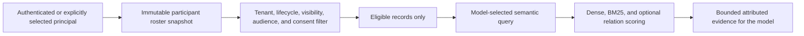

# HISTORICAL ARCHIVE — NOT THE CURRENT IMPLEMENTATION OR SOURCE OF TRUTH

This pre-CP11 target draft was recovered from an obsolete CP7 worktree during
the 2026-08-04 one-source consolidation. The authoritative current architecture
is `docs/architecture/ALI-PARTICIPANT-AWARE-MEMORY.md`.

# Ali Participant-Aware Memory

## Status

This document is the target architecture for Checkpoint 9 (CP9). It is not a
description of behavior available in CP7, and adding this document does not
implement, enable, migrate, or validate any memory behavior.

CP7 still has one selected active-user boundary and one personal Mem0/Qdrant
memory space. CP9 replaces that assumption with participant-aware social and
episodic memory while preserving the model-controlled request path and the
behaviorally frozen Identity module.

## Non-negotiable boundaries

1. Identity is context, not authority. A recognized or present person can help
   the model understand who may be involved in a conversation. Recognition is
   not authentication, consent, ownership, permission, or proof that the person
   spoke particular words.
2. The Identity module remains behaviorally frozen. CP9 consumes its published
   immutable recognition and presence state. Memory work must not change the
   Identity module, block it, back-pressure it, or route around it.
3. The configured model owns semantic interpretation. It proposes typed
   speaker, subject, witness, event, audience, hearsay, relevance, and memory
   operations. Deterministic code validates mechanical boundaries; it must not
   infer those meanings from English keywords, names, pronouns, regular
   expressions, file extensions, or fixed phrase routing.
4. Access filtering happens before relevance scoring. A vector, keyword, graph,
   or reranking stage must never receive a memory that the requesting principal
   is not allowed to access.
5. Background review produces candidates, not hidden durable mutations. It may
   not silently add, update, merge, delete, widen, promote, or consolidate
   personal memory.
6. Every durable record has provenance, audience, consent state, and correction
   lineage. Contradictions remain attributable until an authorized participant
   resolves them.
7. CP9 creates one fresh current-format memory store and fresh vector index. It
   does not add schema-version fields, migrations, legacy runtime branches, or
   compatibility checks for old vector spaces.

## Identity, presence, and authentication

CP9 distinguishes three concepts that must never be collapsed:

- Identity context identifies a possible participant for conversation and
  personalization. It can come from explicit profile selection, a registered
  local profile, or advisory recognition/presence state.
- Consent authorizes a particular memory use: durable storage, a visibility
  audience, correction, revocation, export, or deletion.
- Authentication proves the principal for a consequential capability. It must
  use an independent trusted factor such as an authenticated local session,
  passkey, Windows Hello, or owner credential. Face similarity or passive
  presence cannot satisfy this boundary.

Low-risk conversational personalization may use identity context without
forcing repeated authentication. Reading sensitive/private information,
widening an audience, persisting another person's information, exporting
memory, promoting a directive, exercising privileged tools, or destructive
mutation requires the applicable consent and authentication receipt.

The owner-only recovery/eject path remains outside memory and Identity module
authority. No remembered directive, recognized face, participant role, or model
claim can grant or override recovery authority.

## Immutable participant roster snapshot

At turn admission, the coordinator captures one immutable roster snapshot. It
is context for the model and the authorization validator; it is not mutable
planner state and cannot change halfway through an accepted operation.

The snapshot contains only mechanically sourced facts:

- turn, conversation, and capture timestamp identifiers;
- the explicitly selected local profile, when one is selected;
- opaque participant references for registered profiles;
- session-scoped opaque references for guests or unknown participants;
- display labels suitable for the current UI;
- advisory present/not-present observations, their source, and confidence;
- whether a reference is registered, guest, or unknown; and
- the selection/presence generation used to detect stale work.

The snapshot does not assert who spoke, who a statement concerns, who witnessed
an event, who consented, or who is authenticated. The model proposes those roles
from the complete turn context. Code rejects stale or unknown references rather
than guessing replacements.

## Logical memory record

The CP9 current-format record represents an attributable claim or event, not an
unqualified universal fact. Its logical contract includes:

- a memory ID and local storage-owner/tenant ID;
- concise memory text;
- speaker participant reference, when known;
- zero or more subject participant references;
- zero or more witness participant references;
- an optional shared event reference;
- optional project, component, milestone, and session anchors;
- direct-statement, hearsay, observation, preference, directive, or other
  model-proposed claim kind;
- visibility and explicit audience references;
- source turn/message identifiers and capture time;
- model attribution confidence, kept separate from factual truth;
- candidate, confirmed, revoked, archived, superseded, or disputed state;
- consent receipts applicable to durable storage and audience;
- `corrects`, `supersedes`, and `disputes` lineage references; and
- creation, confirmation, correction, revocation, and archive timestamps.

The tenant is a storage boundary, not permission to reveal every record to the
device owner. Subject, speaker, and audience are independent dimensions. A
record about Bob, spoken by Alice, stored in the owner's local tenant remains
Alice's attributed claim and is visible only to its authorized audience.

## Visibility and audience scopes

Every confirmed record uses the narrowest applicable scope:

- Private: available only to the explicitly named participant or participants.
- Shared: available only to an explicit participant audience.
- Team/project: available to an explicitly configured local team or project
  membership. Membership is authoritative configuration, never inferred from
  conversation text or presence.
- General: available to all locally authorized participants in this Ali
  installation. General never means public, internet-visible, or cloud-shared.

The model may propose a scope, but it cannot authorize it. A mechanical policy
checks that the audience exists, is inside the tenant, and has the required
consent/authentication receipt. Widening scope is consequential and always
requires explicit authorization. Narrowing or revoking scope takes effect
before the next retrieval.

## Guests and consent

Guests and unknown participants receive random session-scoped references. They
must not be linked durably to a biometric observation, another conversation, or
a registered identity merely because recognition appears similar.

Default guest behavior is ephemeral:

- guest statements can inform the current conversation;
- a background worker may form an in-memory candidate;
- no durable guest profile or personal claim is created automatically;
- no guest memory is admitted to another turn without applicable consent; and
- a guest's statement is never stored as the selected owner's personal fact.

Durable guest memory requires explicit scoped consent. If Ali cannot establish
who is authorizing the operation, the candidate remains unconfirmed or expires.
Revocation removes the record from every retrieval scope immediately and starts
the exact configured deletion/retention action. Consent to participate in a
conversation is not consent to durable memory, sharing, avatar creation, or
capability authorization.

An explicit low-sensitivity request such as "remember this private preference
about me" can itself serve as the consent for that narrow operation when it
comes from the authenticated active principal. It does not authorize inferred
facts, third-party subjects, sensitive categories, a wider audience, or future
unrelated mutations.

## Hearsay, shared events, and conflicting perspectives

Hearsay remains attributed. If Alice says "Bob prefers X," CP9 records that
Alice made a claim about Bob. It does not convert the sentence into a confirmed
fact owned by Bob. Direct testimony from Bob, a correction from Alice, and an
independent observation can coexist with separate provenance and confidence.

A shared event has one stable event reference and participant-specific claims:

- common event anchors can be shared with the authorized event audience;
- each participant's private notes and perspective stay in their own scope;
- witnesses are recorded only when the model proposes them from supplied
  context and policy validation succeeds;
- absence from the roster is not proof that a person was absent from the event;
  and
- the model must express uncertainty when claims conflict or are hearsay.

Corrections append lineage instead of erasing history. An authorized correction
creates a new confirmed record linked through `corrects` or `supersedes`; the
prior record becomes superseded or disputed for normal recall. Hard deletion is
an exact-ID, authenticated, auditable operation. A speaker can correct what they
said, a subject can dispute a claim about them, and neither action silently
rewrites another participant's private perspective.

## Model-produced typed attribution

The semantic pass returns a bounded typed candidate containing fields such as:

- proposed memory text and operation;
- speaker, subject, witness, event, and audience references;
- proposed visibility and claim kind;
- direct-statement versus hearsay attribution;
- confidence and uncertainty;
- source turn/message references; and
- requested consent or authentication class.

The deterministic validator may only enforce mechanical rules:

- tenant and turn identity are exact and current;
- participant references exist in the admitted roster or an allowed durable
  profile set;
- audience references are authorized and bounded;
- a mutation names an exact memory ID;
- state transitions and lineage references are valid;
- required consent/authentication receipts match this exact operation;
- input sizes, counts, and timestamps are valid; and
- revoked or inaccessible records cannot re-enter retrieval.

The validator must not choose a speaker, resolve a pronoun, decide that text is
a preference/directive, infer an audience, classify hearsay, rewrite a query,
or substitute a fallback attribution. An invalid proposal returns a structured
failure to the model or user; it never falls back to keyword interpretation.

## Candidate and mutation lifecycle

The normal lifecycle is:

1. The visible conversational answer commits without waiting for memory work.
2. A bounded, cancellable local review receives the immutable turn and roster
   snapshot.
3. The configured model may produce zero or more typed candidates.
4. Mechanical validation rejects stale, cross-tenant, unauthorized, malformed,
   or over-broad candidates.
5. Harmless candidates remain transient or appear in a user-visible review.
6. Applicable consent/authentication confirms the exact text, participants,
   scope, and operation.
7. Only confirmed records enter normal retrieval.

Background review cannot directly call Mem0 inference that performs
`ADD/UPDATE/DELETE/NONE`. Consolidation may propose a summary or supersession,
but it cannot commit either. Ali does not run an autonomous memory mutator while
closed. Shutdown cancels and awaits outstanding review work.

Revoked records are excluded before retrieval. Archived records are also
excluded by default but remain recoverable under explicit policy. Salience or
decay may later influence ranking or archival proposals; model self-approval or
mere recall frequency cannot silently strengthen, weaken, or delete a memory.

User directives are confirmed, scoped, visible, and revocable records. Ordinary
conversation is never promoted automatically into an immutable directive. A
directive may guide the model, while deterministic enforcement is limited to
the exact structured scope the user explicitly authorized.

## Retrieval pipeline

The authorization filter is part of the backing-store query, not a cleanup pass
over already retrieved results. Dense vectors, BM25, future graph traversal, and
reranking operate only on eligible IDs. Cache keys include the requesting
principal, roster/selection generation, audience scope, and index fingerprint;
an entry cannot be reused across those boundaries.

The model chooses when memory is relevant and supplies the semantic query. CP9
does not add a deterministic English interceptor or automatic file-extension,
project-name, or keyword router ahead of the model. Any proactive recall remains
model-selected and subject to the same access filter.

## Low-friction and consequential operations

| Operation | Target interaction |
| --- | --- |
| Use general or explicitly shared low-sensitivity context already authorized for the active principal | No repeated prompt; preserve an audit receipt |
| Create an in-memory candidate after a turn | No prompt and no durable mutation |
| Honor an authenticated participant's explicit request to remember one low-sensitivity private fact about them | The request is the narrow consent; show the saved result and undo path |
| Correct a participant's own confirmed claim by exact ID | Preserve lineage; request only the authentication required for that scope |
| Persist a guest or third-party claim | Explicit subject/speaker consent as applicable |
| Read sensitive/private memory or another participant's private scope | Independent authentication plus audience authorization |
| Widen visibility, export, remote-send, promote a directive, hard-delete, or exercise a privileged capability | Exact user confirmation and consequential-capability authentication |

Approval friction is based on effect and audience, not on recognition confidence.
No recognized face can approve a prompt, satisfy a capability challenge, expose
private memory, or grant standing permission.

## Local privacy boundary

Personal memory remains local by default. Mem0, embeddings, Qdrant, candidate
review, and attribution use loopback/local providers unless the user explicitly
configures and authorizes a secure remote path for the exact data class. A
remote model setting alone is not consent to transmit personal or participant
memory.

Diagnostics and audit receipts record IDs, operations, scopes, outcomes, and
bounded safe errors. They do not copy raw private memory text into general logs.
Transport privacy does not replace participant consent or audience enforcement.

## CP9 hardening gate

Participant-aware work must not begin on top of the known CP7 reliability gaps.
CP9 includes these repairs and focused regression coverage:

1. Assign the private Python worker to a Windows Job Object using
   `JOB_OBJECT_LIMIT_KILL_ON_JOB_CLOSE`, while retaining normal graceful
   shutdown and entire-process-tree fallback.
2. Replace the 500-item ownership scan with exact ID lookup plus authoritative
   tenant/user payload verification. Add bounded pagination for complete
   inventory and exact mutation targeting beyond 500 records.
3. Give the background review queue a lifetime token and asynchronous
   cancel-and-await disposal. No delay or review may outlive its coordinator or
   memory service.
4. Isolate per-point hybrid backfill failures, report exact degraded counts and
   safe identifiers, and provide a deliberate repair/rebuild path. Never install
   an empty sparse vector or silently omit failed memory.
5. Reserve Python stdout exclusively for the framed request/response protocol
   before third-party imports. Route incidental library output to bounded stderr
   diagnostics without corrupting the next request.
6. Replace direct background Mem0 inference mutations with the typed candidate
   lifecycle above.

The reported 0.78-versus-0.74 semantic-score example is not a CP9 defect: the
current strong-score branch already bypasses the lead requirement. CP9 must not
weaken recall filtering on the basis of that invalid example; retrieval changes
require measured, source-backed evaluation.

## Fresh Nomic embedding space

CP9 uses a fresh Mem0/Qdrant embedding space for
`text-embedding-nomic-embed-text-v1.5@q8_0` with the selected 8,192-token
context. Before the index can become available, Ali must verify:

- the actual resolved loaded model identity, not only the configured model
  string;
- provider and protocol identity;
- quantization, dimensions, and selected context;
- exact query and document prefix roles from the resolved embedding profile;
- a functional long-input probe near the selected context, not only endpoint
  reachability; and
- an embedding/index fingerprint covering every value that can change vector
  meaning.

Recall queries use the resolved query role; stored claims, events, summaries,
and tool/document records use the resolved document role. Prefix selection is a
typed provider-profile concern, not English keyword routing.

CP9 creates a new empty collection and matching local Mem0 data root. Old vectors
are never queried under the new fingerprint and are not silently copied. If the
user requests continuity, old records are exported and re-evaluated through the
participant-aware candidate and consent path. The old store may remain as an
explicit backup until the user authorizes removal; no migration engine,
persisted version field, runtime legacy branch, or compatibility shim is added.

## Acceptance criteria

CP9 is not complete until focused tests and live local verification show that:

- two participants can hold conflicting private claims without cross-person
  retrieval leakage;
- private, shared, team/project, and general filters are applied before dense or
  BM25 scoring;
- hearsay remains attributed and cannot silently become a subject-owned fact;
- guests remain session-only without explicit durable consent;
- recognition/presence cannot satisfy authentication or approve a capability;
- malformed or stale model attribution fails without deterministic English
  fallback;
- background review cannot mutate confirmed memory;
- correction, dispute, supersession, revocation, archive, and exact deletion
  preserve their required lineage and audience behavior;
- inventory, correction, and deletion work above 500 records;
- parent-process termination, stdout noise, queue shutdown, and one bad hybrid
  point fail safely with actionable diagnostics;
- resolved Nomic identity, prefix roles, dimensions, protocol, and long-context
  behavior match the stored index fingerprint;
- no old-space vector can enter the fresh CP9 index without explicit
  re-evaluation; and
- memory review and retrieval do not delay the visible answer or create an
  unbounded background backlog.

Until those conditions are observed, this document remains target architecture,
not an implementation or release claim.
